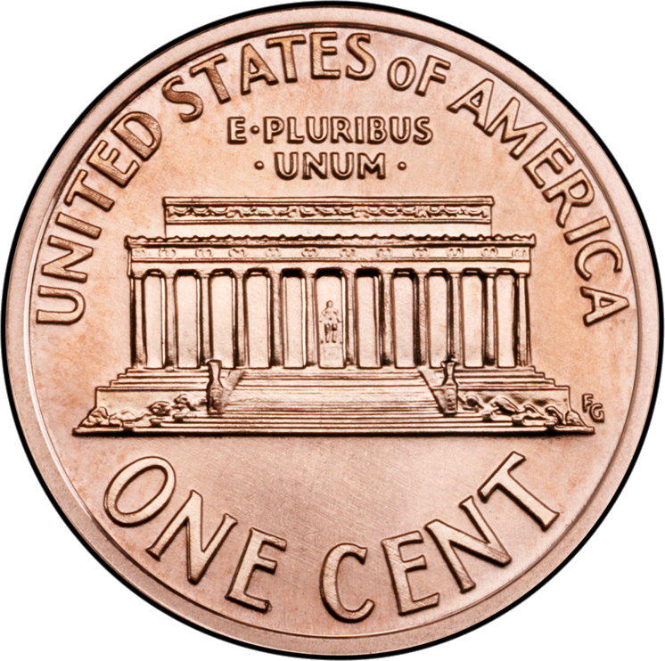
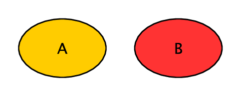
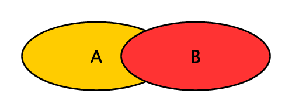
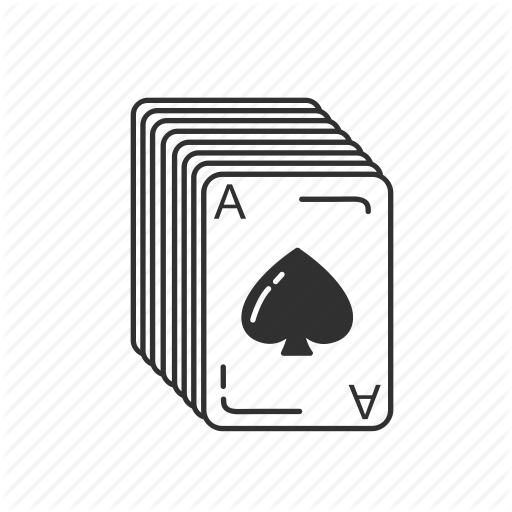
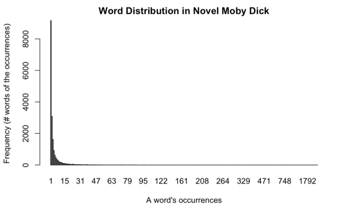
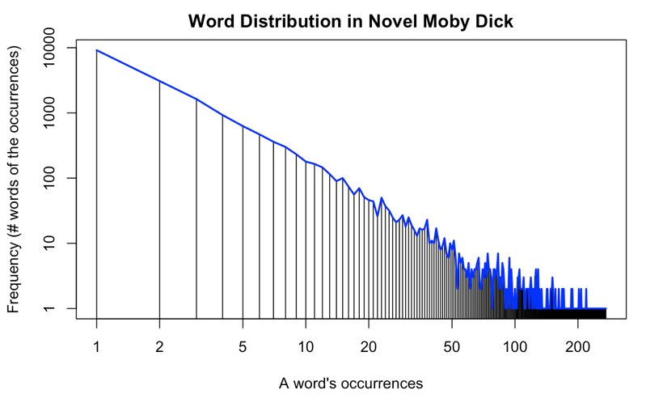

# Probability and Statistical Thinking {#ch-probability}

::: epigraph
Probability theory is nothing but common sense reduced to calculation.

*Pierre-Simon Laplace*
:::

In 2012, a national retailer store broke the news by identifying a teen
pregnancy before her father knew about it. After seeing coupons of baby
clothes and cribs sent to his daughter, the enraged father went to the
store to complain about the incident, only to discover later that he was
the one who needed to apologize for his ignorance.

While this story unfolded a spectrum of ethical and privacy-related
issues, we will focus on the technical question for now -- how did the
store figure out the girl was pregnant and it is therefore relevant to
send her baby coupons?

As one can imagine, this was based on the evidence of related purchases
in the girl's shopping history. But even with that, the store could not
be certain about the pregnancy and had to guess how *likely* that was
the case. Computing the *likelihood* or *probability* is at the core of
the technical problem here. We shall look at the basic theory and rules
of *probability* before we can use them to reduce all this to
calculation.

## Probability

*Probability*, according to the Oxford Dictionaries, is \"the quality or
state of being probable; the extent to which something is likely to
happen or be the case.\" While this definition appears common sense and
easy to understand, in reality we use the term *probability* or
likelihood in two very different ways. In the *Frequentist* view,
probability is equivalent to the long-term frequency of an event's
occurrence. Flipping a *perfect* coin, for example, has a $50\%$
probability to turn up a head and $50\%$ tail because each side has
equal chances (frequencies) if it is repeated for *sufficient* times.

::: {#fig-prob-head-tail layout-ncol="2"}
{fig-alt="Heads side of a coin."}

{fig-alt="Tails side of a coin."}

Head versus tail.
:::

On the other hand, the *Bayesian* view of probability is associated with
the degree of belief without complete information or knowledge. Each
coin flipping has nothing to do with a long-term repetition and which
side it turns up is a result of many factors. Likewise, how likely you
are going to get an A on an upcoming test is a belief based on the known
and the unknown -- for example, how well you are prepared and what
questions the test will be comprised of.

These views are rather divided and may lead to different approaches of
modeling and interpretation. Nonetheless, many methods and tools of
great practical values have been derived from both views. And we can
focus on their application without digging deep into the theoretical
subtlety.

## Probability Basics

We denote the probability of an event A's occurrence as $P(A)$. A
probability is a numeric value between 0 and 1:

$$
0 \le P(A) \le 1
$$

where $0$ probability means the event will never occur and $1$, or
$100\%$, means it will always occur.

Be A the event of turning up a head in a perfect coin flipping,
$P(A)=\frac{1}{2}$; if A is the event of getting number $3$ by rolling a
dice, we may estimate $P(A)$ to be $\frac{1}{6}$ if we assume six equal
sides without additional information.

The probability of the complement of event A, or that A will NOT occur,
is denoted by $P(A')$,[^ch04-1] which can be computed by:

$$\begin{aligned}
P(A') & = & 1 - P(A)
\end{aligned}$$

Head and tail on a coin complement each other. Hence:

$$\begin{aligned}
P(Tail) & = & P(Head') \\
        & = & 1 - P(Head)
\end{aligned}$$

For mutually exclusive events A and B, their union probability, namely
the probability that *either one* of them will occur is the sum of their
individual probabilities:

$$\begin{aligned}
P(A \cup B)
& = & P(A) + P(B)
\end{aligned}$$

{#fig-prob-no-overlap fig-alt="Two separate circles representing events A and B with no overlap." width="45%"}

where the symbol $\cup$ (union) is equivalent to logical OR and implies
addition of the events. When two events are mutually exclusive, they do
not occur simultaneously and, as visualized in
@fig-prob-no-overlap, have *no overlap* or intersection in
their probability space. Because of that, we can simply add the two
together.

In the case of flipping a coin, Head and Tail are mutually exclusive. By
the same rule, we have:

$$\begin{aligned}
P(Head \cup Tail)
& = & P(Head) + P(Tail)
\end{aligned}$$

which is $1$ because Head and Tail complete the entire probability
space. Likewise, numbers $1$ through $6$ on a dice are complete,
mutually exclusive events. The same is true that you always get *one* of
the six numbers on a dice:

$$\begin{aligned}
&   & P(1 \cup 2 \cup 3 \cup 4 \cup 5 \cup 6) \\
& = & P(1) + P(2) + P(3) + P(4) + P(5) + P(6) \\
& = & 1
\end{aligned}$$

## Joint probability

If events A and B are not mutually exclusive, their union probability
should be the sum of their probabilities subtracted by the probability
of them occurring simultaneously -- that is the joint probability:

$$\begin{aligned}
P(A \cup B)
  & = & P(A) + P(B) - P(A \cap B)
\end{aligned}$$

{#fig-prob-overlap fig-alt="Two overlapping circles representing events A and B." width="45%"}

The reason for subtracting the joint probability $P(A \cap B)$ can be
illustrated in @fig-prob-overlap. As shown in the figure, when A and B can
occur simultaneously, they have an overlap (intersection) which should
be discounted so it is not counted *twice* in the addition.

Here is an example of not mutually exclusive events -- what is the
probability of drawing a card from a deck (52 cards) that is *either* an
Ace (4 out of 52) *or* a Spade (13 out of 52). The probability of having
each can be estimated by:

$$\begin{aligned}
P(Ace) & = & \frac{4}{52} \\
P(Spade) & = & \frac{13}{52}
\end{aligned}$$

{#fig-prob-ace-spade fig-alt="An ace of spades card representing the intersection of aces and spades." width="35%"}

Because there is $1$ card that is both an Ace and a Spade, the joint
probability is $P(Ace \cap Spade) = \frac{1}{52}$ and the union
probability can be computed by:

$$\begin{aligned}
&   & P(Ace \cup Spade) \\
& = & P(Ace) + P(Spade) - P(Ace \cap Spade) \\
& = & \frac{4}{52} + \frac{13}{52} - \frac{1}{52}
\end{aligned}$$

## Independent events

Again, the joint probability of A and B, denoted by $P(A \cap B)$,[^ch04-2]
is the probability that both A and B will occur.

If A and B are independent, meaning the occurrence of A has nothing to
do with the occurrence of B, then the join probability can be computed
by the simple multiplication:

$$\begin{aligned}
P(A \cap B) & = & P(A) P(B)
\end{aligned}$$

For example, if you flip a coin and roll a dice, how likely will you get
a Head *and* number $3$. Because the two events are independent, their
joint probability can be computed by:

$$\begin{aligned}
P(Head \cap 3)  & = & P(Head) P(3) \\
                & = & \frac{1}{2} \times \frac{1}{6}
\end{aligned}$$

The joint probability is certainly not limited to two events. You can
apply the same rule to three or more independent events. For a set of
independent events $E = \{E_1, E_2, .., E_m\}$, their joint probability
is computed by the product of their probabilities:

$$\begin{aligned}
P(E_1 \cap E_2 \cap .. \cap E_m)
& = & \prod_{i=1}^{m} P(E_i)
\end{aligned}$$

Again, the equation holds as long as the events are independent -- that
is, one event's occurrence does not influence the other. While this is
often unrealistic, event independence is often assumed for model
simplicity.

## Dependent Events

Now let's take a step further and look at joint probability of dependent
events. If the occurrence of A is dependent on the occurrence of B, we
can use $P(A|B)$ to denote the probability of event A *on the condition
that* event B has already been observed. This conditional probability is
referred to as the *posterior probability* because it is estimated after
the fact (here the observation of event B).

The joint probability that both events A and B will occur is then
computed by:

$$\begin{aligned}
P(A \cap B)
& = & P(A|B) P(B)
\end{aligned}$$

where $P(B)$ is the *prior probability*, which is a priori before the
further observation of data. Again, $P(A|B)$ is the *posterior
probabilities* conditioned on the observation of the other event and is
about the probability that event A will occur if we know event B occurs.
Likewise, the joint probability can also be computed by:

$$\begin{aligned}
P(A \cap B)
& = & P(B|A) P(A)
\end{aligned}$$

This is based on the prior probability of and the posterior probability
conditioned on event A. So far the discussion on probability may look
quite abstract. So let's take a look at an example to make sense of
this.

Suppose you are running a restaurant and you look at your transaction
data, and try to learn about the statistics on how to improve your
business. Suppose you find out $60\%$ of the customers order burgers,
$54\%$ order burgers and fries. Now you want to know -- if a customer
already orders a burger, how likely he will also order fries. And this
question is certainly relevant to your business.

First let's setup proper notation. Let:

- $F$ be the event that a customer orders *fries*, and

- $B$ be the event that a customer orders *burgers*.

In this case, you know $60\%$ of the chance a customer orders burgers,
which is $P(B) = 0.60$. With $54\%$ of customers ordering both burgers
AND fries, the joint probability of the two events $P(F \cap B) = 0.54$.

Now the question is about the probability of a customer ordering fries
($F$), *on the condition* that she has already ordered a burger ($B$),
which is the posterior probability $P(F|B)$. By replacing A and B with F
and B respectively in
Equation [\[eq-prob-joint_dep\]](#eq-prob-joint_dep){reference-type="ref"
reference="eq-prob-joint_dep"}, we have:

$$\begin{aligned}
P(B) P(F|B) & = & P(F \cap B)
\end{aligned}$$

Divide both sides by P(B), we get:

$$\begin{aligned}
P(F|B)
& = & \frac{P(F \cap B)}{P(B)} \\
& = & 0.54 / 0.60 \\
& = & 0.90
\end{aligned}$$

So it appears the customer will probably (with $90\%$ probability) order
fries as well if she is ordering a burger.

We can also apply these probability rules to the retailer store story we
discussed at the beginning of the chapter. We can ask questions like --
if a customer has purchased a crib, how likely will she be interested in
coupons of baby clothes? With other related evidence in the shopping
history, can we predict whether the customer is pregnant (or how likely
she is) and, if so, follow up with customized marketing efforts?

## The Bayesian Theorem

To attack the above questions, we need to take one step further and look
at the Bayes Theorem.

From
equations [\[eq-prob-joint_dep\]](#eq-prob-joint_dep){reference-type="ref"
reference="eq-prob-joint_dep"} and
[\[eq-prob-joint_dep2\]](#eq-prob-joint_dep2){reference-type="ref"
reference="eq-prob-joint_dep2"}, we have:

$$\begin{aligned}
P(A|B) P(B)
& = & P(B|A) P(A)
\end{aligned}$$

Divide both sides by $P(B)$, we get:

$$\begin{aligned}
P(A|B) = \frac{P(A) P(B|A)}{P(B)}
\end{aligned}$$

And with this, we arrive at a very important probability rule, the
*Bayes' Theorem* (rule) on computing posterior probabilities. It is
named after Rev. Thomas Bayes[^ch04-3] and further developed by Pierre-Simon
Laplace. The rule provides a foundation for various applications with
Bayesian inference and probabilistic modeling.

## Naive Bayes' Model

Let us look at an application of the Bayes Theorem to get a sense of how
useful the theory is in solving practical problems. One such application
is the Naive Bayes model, which is widely adopted in machine learning,
data mining, and information retrieval. Pay attention to the two
keywords -- *Naive* and *Bayes* -- the model is *Naive* because the it
has naive assumptions about variable *independence*, and is *Bayesian*
because the core of the model is the Bayes' Theorem.

Ultimately, the Naive Bayes model is to estimate the probability of an
inference (hypothesis $H$) given observed data (evidence $E$), that is,
in the binary scenario, for example, $P(H|E)$ (true) vs $P(H'|E)$
(false). We can compute these probabilities according to the Bayes'
rule:

$$\begin{aligned}
P(H|E) & = & \frac{P(E|H) P(H)}{P(E)} \\
P(H'|E) & = & \frac{P(E|H') P(H')}{P(E)}
\end{aligned}$$

where prior probability $P(E)$ is the common denominator that does not
differentiate the two and can be ignored for now. $P(H)$ and $P(H')$ can
be estimated a priori without evidence $E$, whereas $P(E|H)$ and
$P(E|H')$ can be computed using data observed, in cases when the
hypothesis holds or when it does not.

We shall use a specific example to show how it works. In clinical
diagnosis, a doctor observes a patient's symptoms (evidence) and
determines whether the patient has certain disease (inference /
hypothesis). Chickenpox, for example, exhibits symptoms such as fever
and blisters (rash). Let:

- $E_1$ denote the symptom of fever, and

- $E_2$ denote the symptom of blister (rash).

The question is how likely the patient has developed chickenpox
(hypothesis $H$) if there are symptoms of both fever $E_1$ and blisters
$E_2$.

Suppose[^ch04-4] the prevalence of chickenpox is $20$ in every $1,000$
individuals, that is $P(H) = 0.02$ and $P(H')=0.98$; of those *who
develop chickenpox*, $90\%$ have fever ($P(E_1|H)=0.90$) and $55\%$ have
blisters ($P(E_2|H)=0.55$); of those *without chickenpox*, the chances
of have these individual symptoms are $P(E_1|H')=0.10$ for fever and
$P(E_2|H')=0.05$ for blisters.

The first probability we need to attack is $P(E|H)$, the probability
that a patient exhibiting the observed symptoms *if* she indeed has
chickenpox. Because we consider two symptoms here, this is about the
joint probability when fever and blisters appear simultaneously. With
the *Naive* assumption that the symptoms' occurrences are statistically
independent, $P(E|H)$ can be computed by:

$$\begin{aligned}
P(E|H)
& = & P(E_1|H) P(E_2|H)
\end{aligned}$$

Put this in
Equation [\[eq-prob-bayes_he\]](#eq-prob-bayes_he){reference-type="ref"
reference="eq-prob-bayes_he"} and we get:

$$\begin{aligned}
P(H|E)
& = & \frac{P(E_1|H) P(E_2|H) P(H)}{P(E)} \\
& = & \frac{0.90 \times 0.55 \times 0.02}{P(E)} \\
& = & \frac{0.0099}{P(E)}
\end{aligned}$$

Likewise, we can compute the probability of a false hypothesis given the
same evidence (symptoms) by:

$$\begin{aligned}
P(H'|E)
& = & \frac{P(E_1|H') P(E_2|H') P(H')}{P(E)} \\
& = & \frac{0.25 \times 0.02 \times 0.98}{P(E)} \\
& = & \frac{0.0049}{P(E)}
\end{aligned}$$

The result shows $P(H|E) > P(H'|E)$, meaning that it is more likely than
not the patient has developed chickenpox. Again, this model is based on
the Bayes' theorem and the assumption that evidential events (symptoms)
observed are statistically independent. In another word, the occurrence
of one symptom has nothing to do with the other. In reality we know this
independence assumption is rarely true. For example, one who has
blisters is more likely to have fever than those without.

In the above example, we only use two pieces of evidence (symptom
observation) to model the likelihood of chickenpox. In reality, this can
be extended to any number of predictor variables where $E$ is a set of
variables $E_1, E_2, .., E_m$ and $m$ is the size of the set. In this
general case, the Naive Bayesian Model in
equation [\[eq-prob-bayes_he\]](#eq-prob-bayes_he){reference-type="ref"
reference="eq-prob-bayes_he"} can be extended to:

$$\begin{aligned}
P(H|E)  & = & \frac{P(E|H) P(H)}{P(E)} \\
        & = & \frac{P(E_1|H) P(E_2|H)..P(E_m|H) P(H)}{P(E)} \\
        & = & P(H) \prod_{i=1}^{m} P(E_i|H) / P(E)
\end{aligned}$$

Likewise, on the probability of a false hypothesis:

$$\begin{aligned}
P(H'|E)  & = & P(H') \prod_{i=1}^{m} P(E_i|H') / P(E)
\end{aligned}$$

where variables $E_1, E_2, .., E_m$ are assumed to be statistically
independent. The main purpose of having this naive assumption is for
mathematical simplicity when we compute joint probabilities. Although
this assumption is at odds with reality, related models have turned out
to perform quite well in experiments. Practically the number of
variables (features) $m$ can be very large. For example, in text
analysis, it is common to treat unique words as individual features
(variables) and, with even a moderate text collection, there can be tens
of thousands, if not millions, of variables in the model.

The Bayes Model is not limited to a binary case, e.g. chickenpox vs. not
chickenpox. It can also be applied to any classification problem on a
number of discrete outcomes. In that case, we simply need to compute the
probability of each discrete outcome (hypothesis) and find out which one
has the greatest likelihood. It can also be extended to a continuous
case where numeric predictions can be made based on certain probability
distribution models, which we will discuss later in the chapter.

## Probability Estimators

Again, consider
Equation [\[eq-prob-bayes_hem\]](#eq-prob-bayes_hem){reference-type="ref"
reference="eq-prob-bayes_hem"}, in order to compute the probability of
each hypothesis, we need to first estimate the probability of each
evidence $E_i$ in $\prod_{i=1}^{m} P(E_i|H)$. Where do these
probabilities come from? Essentially they are learned from the training
data where we can count their frequencies, or the number of times each
unique situation occurs. For now, the probability $P(E_i | H)$ is
computed by:

$$\begin{aligned}
P(E_i | H) & = & \frac{F(E_i | H)}{F(H)}
\end{aligned}$$

where $F(E_i | H)$ is the number of instances with $E_i$ where
hypothesis $H$ is true and $F(H)$ is the total number of instances with
the true hypothesis.

Imagine you are working on the problem of email spam detection. You have
a training data set of $1,000$ emails and $100$ have been identified
spams (where hypothesis $H_{spam}$ is true). Suppose $prize$ is one of
the keywords (evidence $E_{prize}$) that can be used to model the spam
detection problem and, of the $100$ spam emails ($H_{spam}$) there are
$20$ containing that keyword *prize*. In this case, $F(H_{spam}) = 100$
and $F(E_{prize} | H_{spam}) = 20$ so, according to the probability
estimator in equation [\[eq-prob-pf\]](#eq-prob-pf){reference-type="ref"
reference="eq-prob-pf"}, the probability $P(E_{prize} | H_{spam})$ can
be computed by:

$$\begin{aligned}
P(E_{prize} | H_{spam})
  & = & \frac{F(E_{prize} | H_{spam})}{F(H_{spam})} \\
  & = & 20 / 100 \\
  & = & 0.2
\end{aligned}$$

This will work just fine as long as the relative frequencies
(occurrences) of related keywords in the training data (*sample*) are
proportional to those of the same keywords in all spam emails in the
world (*population*). In this case, we assume what we observe in the
sample data is what will most likely occur in the population.

In reality, however, we may observe data in samples with varied
departures from the entire population. Imagine we want to use *prize* as
one feature in the Naive Bayes but observe no occurrence at all of this
term in the training spam data, that is $F(E_{prize} | H_{spam}) = 0$.

In this case, are we to simply conclude the probability of having
*prize* in *any* spam email $P(E_{prize} | H_{spam})$ is $0$? This is
obviously a premature conclusion -- the fact that you have not seen an
*elephant* does not lead you to conclude on the non-existence of that
very creature. There is variance in the data and we do not want to be
misled by data in its departure (skewness) from the overall reality.

{#fig-prob-elephant
width="3in"}

Data may be localized, just as the story of *blind men and elephant*
shows (@fig-prob-elephant). But we should aim to see the whole
picture.

In addition, there is also an undesired consequence for having a zero
probability in the Naive Bayes model. With $E_{prize}$ as one of the
evidence features, its probability $P(E_{prize} | H_{spam})$ is one of
the factors in computing the product in the Bayes equation above. When
$P(E_{prize} | H_{spam}) = 0$,
it leads to $P(H|E) = 0$ regardless of the values of other variables.

In short, we have observed that zero probabilities are not desirable,
neither theoretically nor practically. One simple remedy to zero
probability estimates, as suggested by Pierre Laplace, is to add $1$ to
each frequency (count) in the sample. So the frequency of having term
$prize$ in the spams becomes:

$$
F(E_{prize} | H_{spam}) + 1
$$

To be fair, we also need to add $1$ to other frequency counts, including
the frequency of NOT having the term $prize$ in the spam subset:

$$
F(E'_{prize} | H_{spam}) + 1
$$

The above two are complete and mutually exclusive cases. Hence, the
total number of instances in the spams becomes:

$$\begin{aligned}
 &   & F(E_{prize} | H_{spam}) + 1 + F(E'_{prize} | H_{spam}) + 1 \\
 & = & F(H_{spam}) + 2
\end{aligned}$$

Note that we add $2$ to the total number because we have a binary
variable, namely having term $prize$ (true) vs. not having it (false).
If a variable has $k$ discrete values, then we need to add $k$ to the
total. For example, a categorical variable that marks an email's
importance may have three different levels such as *low*, *normal*, and
*high*. If we add $1$ to the frequency of each level, in the end we will
have added $3$ to the total.

But the question then is why add $1$? In fact the idea is that we can
add any *constant* $c$ to each count so zero values can be avoided. And
the probability of observing a variable value $v$ within the sample
where the hypothesis is true can be computed by:

$$\begin{aligned}
P(E_i = v | H) & = & \frac{F(E_i=v | H) + c}{F(H) + kc}
\end{aligned}$$

where $k$ is the number of discrete values variable $E_i$ can have, e.g.
$k=3$ for the email priority variable, and $c$ is a chosen constant
which represents some prior knowledge about the chance of any value. A
great $c$ value will make the probability more predetermined and a
lesser value gives relatively more weigh to frequencies observed in the
sample data. When a discrete value occurs less frequently in the sample,
$c$ will change its probability estimate more dramatically.

In a sense, an added constant $c$ favors the rare values and penalizes
the frequent ones. Other than simplicity, is this a rational strategy to
estimate the probabilities? The answer depends on how much we know about
the probability distributions with or without the sample data. If in
fact we know some values are going to occur more frequently regardless
-- for example, we can safely assume most emails would have been marked
as *normal* -- then we should add more to its count proportionately in
the sample data. The probability can be estimated by:

$$\begin{aligned}
P(E_i = v | H) & = & \frac{F(E_i=v | H) + c p_v}{F(H) + k c}
\end{aligned}$$

where $p_v$ is the *a priori* probability of each discrete value $v$
($v \in [v_1, v_2, .., v_k]$) and they add up to $\sum_v p_v = 1$. The
assignment of $p_v$ values depends on *prior knowledge*. Practically it
is not always clear how they can be obtained. Besides domain knowledge,
training samples are often the major source where we gather related
statistics so the simple transformation of adding $1$ or another
constant is what works in many practical applications.

## Probability Distributions and Models

Think about this. The very fact that we have to *normalize* the obtained
frequencies -- to avoid zeros or for other purposes -- indicates that we
do not totally trust what observed data (samples) can tell us about. The
underlying assumption is that we have certain understanding (prior
knowledge) about how data should behave and we will need to *correct*
the data whenever they *drift* from that expected behavior. By doing the
normalization or smoothing, we impose a *model* of expected *probability
distributions* on the analysis.

We shall now prepare us with an introductory discussion of probability
distributions, from discrete to continuous cases.

{#fig-prob-coin-freq fig-alt="Bar chart with equal frequencies of 500 for heads and tails." width="55%"}

First let's look at some discrete cases. Imagine you toss a coin for
1000 times and in the perfect world you get 500 heads and 500 tails. And
you can create a simple bar plot to show the frequency distribution of
500 for both heads and tails. This is a uniform distribution because
every event, head vs. tail, has an equal chance.

{#fig-prob-coin-prob fig-alt="Bar chart with probability 0.5 for heads and 0.5 for tails." width="55%"}

Now instead of talking about frequencies or counts, we can describe the
distribution in terms of chance (probabilities). And in this case, head
and tail have equal chances (probabilities) of 50% or 0.5 in the
distribution, as @fig-prob-coin-prob shows.

For the sake of discussion, let's extend the binary case, head vs. tail,
to a larger number of exclusive outcomes. For example, imagine you roll
a dice. If you roll it for a sufficient number of times, the sides will
have equal chances to appear, that is, each side from 1 to 6 has a
probability of 1/6 to occur, as shown in
@fig-prob-dice.

{#fig-prob-dice fig-alt="Uniform bar chart assigning probability one sixth to each face from one through six." width="65%"}

Two simple but important observations here:

1.  The probabilities of the six sides add up to one because they are
    exhaustive, mutually exclusive choices;

2.  The probability distribution is a uniform distribution as they are
    all equal. The heights of the bars form a flat, horizontal line that
    characterizes the uniform distribution.

## Continuous Probability Distribution

So far these are discrete distributions. But we can extend this to a
continuous distribution. If the outcome $x$ is no longer limited to such
integers or specific labels. Perhaps the outcome of the question at hand
can be any number in the range of 1 and 6, and you are to predict that
number. If it is a uniform distribution in with the continuous variable,
it remains a flat line in the range of 1 - 6, shown in @fig-prob-cont.

{#fig-prob-cont fig-alt="Flat probability-density line between one and six." width="65%"}

Again, when we add all probabilities up in the distribution, the total
should still be $1$. But because this is a continuous space, we are
talking about infinite amount of numbers. The outcome can be number 3 or
any decimal number such as $3.14159$. To add the infinite number of
heights (some sort of \"probability\" values) in the distribution is
essentially *integration* of the distribution function (a flat line in
this case), that is, the area under the distribution line or curve. The
result of the integration or the entire area will *always* be $1$, as
long as the plotted range includes all possible outcomes.

With a uniform (flat) distribution, the area is a rectangle as shown in
@fig-prob-cont and it is easy to calculate the area. In the
above case, the area of the rectangle between $1$ and $6$ can be
computed by width times height, which is $(6-1) \times 0.2 = 1$. So this
meets the expectation that the sum of the entire probability
distribution is $1$.

Although the above is discussed as a *probability* distribution, we
shall clarify on an important concept. The uniform height $0.2$ in
@fig-prob-cont is NOT a probability value per se. It is what
we refer to as a *probability density*, but not exactly a probability.
For now, let us move on from the uniform distribution to a more common
distribution in the real world before we come back to elaborate on the
concept of *probability density* again.

In the real world, you do not often see uniform distributions[^ch04-5].
Normal (Gaussian) distributions are much more common. For example, if we
collect statistics about adult male heights in the U.S., you will see
the heights are not equally likely. Instead, the overwhelming majority
of (average) people have the average height around 70 inches. And much
rarer are shorter than 62 or taller than 78. The whole distribution is a
bell curve as shown in the figure here.

{#fig-prob-height fig-alt="Bell-shaped probability-density curve centered near the average adult male height." width="65%"}

This is again a probability density distribution so if you integrate the
curve, the total area under it will be $1$ or $100\%$ probability. When
you pick a particular number on the $x$ axis such as $70$ inches in the
middle, you notice it is $y = 0.1$ on the distribution curve. Now be
careful that this value $0.1$ does NOT mean that there is $10\%$ chance
to be $70$ inches height (exactly).

Because they are infinite number of values in the range, each exact
height value in fact has a $0$ probability to occur. The reason is when
we say $70$ inches, we mean exactly $70.000000...$ with an infinite
number of decimal zeros. And it is close to *impossible* to get that
exact value on a continuous scale.

Back to the question. So what does a value like $0.1$ mean on the $y$
axis? It means $0.1$ probability density -- that is, $0.1$ probability
*per inch* (range) on the adult height scale. And this value will change
if you change the unit of height, for example by switching to
centimeters.

What does this probability density entail now that it is not probability
and it varies on the measuring unit? Probability density does allow you
to compare probabilities of different continuous *values* and *value
ranges*. For example, in the normal distribution here, you can still
tell that the probability of a height *around* $70$ inches is greater
than that in the proximity of $80$. But to tell the exact probability,
you will need to specify a range. You can ask the question of how likely
an adult height is $70$ *something* (i.e. between 70 and 71) inches. And
you can integrate the area under the bell curve in the range to find
out.

To reiterate this point -- on the simpler example of the uniform
distribution presented in @fig-prob-cont, the $0.2$ value on y is not probability but
probability density or probability per unit. You can still tell that all
probabilities are equal by looking at the flat line. And you can ask the
question about how likely you will get a value between 2 and 4 by
multiplying the density which is $0.2$ and the range which is $2$ and
the result turns out to be $0.4$ -- that is $40\%$ of the chance you
will get a value *in that range*.

As always, all probabilities add up to $1$ as you can verify by
$0.2 \times (6-1) = 1$. So if you ask how likely a value occurs in the
range between $1$ and $6$, given the distribution in @fig-prob-cont, the answer is that it will *always be true*.

There are several major categories of probability distributions beyond
the uniform and normal distributions we discussed here. Some of these
are asymmetric, exhibiting a form of imbalance between the lower and
higher ends. Power-law distributions and their variations, for example,
are very common in many natural and social structures. They are often
associated with basic *counts* in these structures and activities.

The distribution of wealth or income is an example of the power-law
distribution, where the overwhelming majority is *poor* (with relatively
little wealth) and a small percent at the top are extremely wealthy.
This is a result commonly regarded as due to the *Matthew Effect*[^ch04-6],
in which the rich get rich. In citation and network analysis, this
effect is also known as the *cumulative advantage*[@Price1976] or
*preferential attachment*[@Barabasi1999].

Spoken language (word frequencies) follows the Zipf law, which can be
regarded as a special case of the power-law distribution.
@fig-prob-word-freq shows the distribution of word
frequencies taken from the novel *Moby Dick*. As shown in
@fig-prob-word-freq (a), there is a great divide between the
rich and the poor -- a large number of words have only been used once or
twice in the novel (tall bars on the left of the distribution) where
very few words have a frequency higher than $100$ (the long tail).

It is difficult, however, to examine the long tail on normal coordinates
as the values are very small (low) within a long range. Logarithmic
transformation is often conducted to better visualize the distribution.
The result is @fig-prob-word-freq (b), where both $x$ (words' occurrences)
and $y$ (frequencies of the occurrences) have been transformed with
logarithm.[^ch04-7]

::: {#fig-prob-word-freq layout-ncol=2}
{fig-alt="Word frequency distribution on normal coordinates" width="2in"}

{fig-alt="Word frequency distribution on log-log coordinates" width="2in"}

Word frequency distribution
:::

One prominent characteristic of a power-law distribution is that it
follows a straight line on log-transformed coordinates spanning across a
vast range of numeric orders and is therefore considered *scale free*.
One should caution though that many distributions may roughly look
linear with log-transformation when they are in fact the result of a
different distribution. In reality, there are various constraints and
capacity limits on related structures where the outcome is not ideally
power-law. In social networks, for example, even those who are super
active can only maintain up to a certain number of friendly contacts and
therefore the outcome of friendship distribution will be subject to such
human limits and not scale-free.

## Probability Estimators

The first approach we used to compute probability is to follow whatever
the sample data tell us. If we take a sample of $1000$ emails and $300$
of them are spams, the estimated probability is given by
$300/1000 = 0.3$. If we analyze $100$ emails and *NONE* of them have the
term *prize* in them, then we are bound to conclude the probability that
we will ever encounter the term is $0$. This naive method of trusting
whatever in the sample data is part of a spectrum of methods referred to
as the *Maximum Likelihood Estimator* (MLE).

Simply put, an MLE chooses as estimates the values that maximize the
likelihood of the observed sample. In the case of observing $0$ emails
with term *prize* in the sample, we shall thus estimate the term never
occurs in any email in the whole world (population) so that NOT
observing it is the most likely outcome, which is the case of the
observed sample. In general, for discrete distributions, the result of
an MLE is given by frequencies of related values in the sample without
further transformation.

### Discrete Probability Estimation

Now if we have additional knowledge about the domain and can assume
probabilities follow a particular distribution model, then the question
becomes how we can specify parameters of that model to maximize the
probability of the observed data. Suppose among all emails you receive,
you find out for three particular days there are $5$, $3$, and $7$
emails containing the term *prize* on each day. We assume that:

- The number of such emails you receive one day is independent of that
  on another day. That is, receiving more or less such email today does
  not affect the number you will receive tomorrow and in the future.

- During a small time interval, the probability of receiving such an
  email is proportional to the length of the time interval. That is, the
  longer the time, proportionally greater the probability.

Under these conditions, the probability of receiving $x$ number of
*prize* emails can be modeled by a Poisson probability distribution and
the probability mass function is:

$$\begin{aligned}
P(x) & = & e^{-\mu} \frac{\mu^x}{x!}
\end{aligned}$$

where:

- $e$ is the Euler constant which is approximately $2.71828$;

- $x$ is the number of such emails in question, and $x!$ is the
  factorial
  $x!=x \times (x-1) \times (x-2) \times .. \times 2 \times 1$;

- $u$ is the only parameter, the mean number of *prize* emails, to be
  estimated.

With an MLE, we are to maximize the likelihood of obtaining the 3-day
sample, that is the joint probability of having $5$, $3$, and $7$ emails
$P(x=5 \cap x=3 \cap x=7)$ on three separate days. Now that we assume
the days are independent, the joint probability can be computed by:

$$\begin{aligned}
  & & P(x=5 \cap x=3 \cap x=7) \\
  & = & P(x=5) P(x=3) P(x=7)
\end{aligned}$$

With the Poisson probability function in
Equation [\[eq-prob-poisson\]](#eq-prob-poisson){reference-type="ref"
reference="eq-prob-poisson"}, this becomes:

$$\begin{aligned}
  &   & P(x=5 \cap x=3 \cap x=7) \\
  & = & e^{-\mu}\frac{\mu^5}{5!} \times e^{-\mu}\frac{\mu^3}{3!} \times e^{-\mu}\frac{\mu^7}{7!} \\
  & = & \prod_{x \in [5,3,7]} e^{-\mu} \frac{\mu^x}{x!}
\end{aligned}$$

Now MLE of the Poisson distribution is to estimate the only parameter,
the value of mean $\mu$, so that the above probability in
Equation [\[eq-prob-point_poisson\]](#eq-prob-point_poisson){reference-type="ref"
reference="eq-prob-point_poisson"} is maximized. Now instead of
maximizing the product (multiplications) of the probabilities, we can
take the logarithm of
Equation [\[eq-prob-point_poisson\]](#eq-prob-point_poisson){reference-type="ref"
reference="eq-prob-point_poisson"}, which becomes:

$$\begin{aligned}
l(\mu) & = & \ln(\prod_{x \in [5,3,7]} e^{-\mu} \frac{\mu^x}{x!}) \\
& = & \sum_{x \in [5,3,7]} \ln(e^{-\mu} \frac{\mu^x}{x!})
\end{aligned}$$

and try to maximize the sum of log likelihood[^ch04-8]. We can do this by
taking the derivative of
Equation [\[eq-prob-point_poisson_log\]](#eq-prob-point_poisson_log){reference-type="ref"
reference="eq-prob-point_poisson_log"}:

$$\begin{aligned}
l'(\mu) & = & \frac{1}{\mu} \sum_{x \in [5,3,7]} x - n
\end{aligned}$$

where $n$ is the number of observations of the sample, which is $3$ for
3 days. The maximum can be reached with the derivative at $0$, which is:

$$\begin{aligned}
  &   & \frac{1}{\mu} \sum_{x \in [5,3,7]} x - 3 \\
  & = & \frac{5+3+7}{\mu} - 3 \\
  & = & 0
\end{aligned}$$

And we can conclude that:

$$\begin{aligned}
\mu & = & (5 + 3 + 7) / 3 \\
    & = & 5
\end{aligned}$$

maximizes the probability of observing the sample data of $3$, $5$, $7$
on three days following the Poisson distribution. With the estimate for
parameter $\mu=5$, we can now compute the probability for any discrete
value with
Equation [\[eq-prob-poisson\]](#eq-prob-poisson){reference-type="ref"
reference="eq-prob-poisson"}. For example, we can find out that it is
very unlikely on one day to receive $10$ emails containing the term
*prize*:

$$\begin{aligned}
  P(x=10)
  & = & e^{-\mu} \frac{\mu^x}{x!} \\
  & = & e^{-5} \frac{5^{10}}{10!} \\
  & \approx & 0.01
\end{aligned}$$

We can also make it a general case that, a Poisson MLE shall estimate
the paramter $\mu$ based on the sample mean:

$$\begin{aligned}
\mu & = & \bar{x} \\
    & = & \frac{\sum_{i=1}^{n} x_i}{n}
\end{aligned}$$

where $n$ is the number of observations in the sample data.

### MLE for a Continuous Variable

For a continuous variable, we can also assume a specific functional form
of its distribution such as a normal distribution and the objective of
an MLE is to estimate related parameters (e.g. mean $\mu$ and variance
$\delta^2$) of the distribution function, from which the sample data are
most likely to be observed. These parameter estimates are then used to
compute probability densities at specific values or probabilities within
certain ranges.

Suppose $X$ is a numeric variable with a normal distribution, the
probability of any value $x$ is given by the following function:

$$\begin{aligned}
  f(x) & = & \frac{1}{\sqrt{2\pi\delta}} e^{-\frac{(x-\mu)^2}{2\delta^2}}
\end{aligned}$$

This is one of the most recognized formulas in statistics. Although it
looks daunting, there are only two parameters and the rest are
constants, including $\pi$ the ratio of a circular circumference to its
diameter which is about $3.14159$. From a sample data of $n$ instances,
the two parameters, namely mean $\mu$ and variance $\delta^2$, can be
estimated by the sample mean and variance:

$$\begin{aligned}
  \hat{\mu} & = & \frac{\sum_{i=1}^{n} x_i}{n} \\
  \hat{\delta^2} & = & \frac{\sum_{i=1}^{n} (x_i - \hat{\mu})^2}{n-1}
\end{aligned}$$

where $x_i$ is each observed value of $x$ in the sample data.

Normal distributions are symmetric with the highest probability density
at the very center of the bell curve. Given the objective of MLE to
maximize the likelihood of observed sample, it makes sense that the
parameter estimates should ultimately put the sample data at the center
(so they are more likely to occur). Now that the center is also the mean
of the symmetric distribution, we can now estimate the population mean
using directly the mean of the sample, which is what
Equation [\[eq-prob-norm_paras\]](#eq-prob-norm_paras){reference-type="ref"
reference="eq-prob-norm_paras"} does.

## Summary

Because it is probabilistic, we assume there is no absolute certainty.
So any probability estimate is a guess based on the data you have and
best evidence you can identify. There is always a chance it may go
wrong. And so we are not to blindly trust the outcome/prediction of a
model (neither probabilistic nor any other models). In many critical
settings, human machine collaboration is key -- in the medical
environment, there have been retrieval and AI systems that can provide
necessary assistance to technicians and physicians, but they are not
there to take over and do everything for us. That said, we also have to
recognize there are human errors as well. When we think and make
decisions, even as professionals/experts, we cannot be 100 In short, the
point is -- models are not perfect, as humans are. So the best way is to
understand what they are really good at and in what ways we can use
their assistance.

[^ch04-1]: The complementary probability can also be denoted by $P(\bar{A})$,
    $P(\neg{A})$ or $P(A^c)$.

[^ch04-2]: Joint probability can also be denoted by $P(A, B)$ or P(A AND B).

[^ch04-3]: Richard Price helped publish Bayes' essay with the formula in
    1763, after he passed away. Price, a moral philosopher, regarded
    Bayes Theorem as a means to reason on the probability of miracles
    and to prove the existence of God.

[^ch04-4]: Numbers in the chickenpox example are hypothetical and only
    intended for the sake of computational exercise here.

[^ch04-5]: Even in an equal-opportunity society, there is rarely any even
    (uniform) distribution of goods, wealth, etc.

[^ch04-6]: The term *Matthew Effect* is named after the Gospel of Matthew, in
    which Jesus is recorded as saying, \"for to every one that hath
    shall be given, and he shall abound: but from him that hath not,
    that also which he seemeth to have shall be taken away\" with the
    parable of the talents.

[^ch04-7]: Essentially log-transformation reduces a number to its order, e.g.
    $1000$ to $3$ and $100$ to $2$ with $log_{10}$.

[^ch04-8]: With a positive variable such as a probability, when its value $p$
    increases, its $log(p)$ always increases. So when $log(p)$ reaches
    its maximum, so does the $p$ value. Because of this, we can maximize
    $log(p)$ in order to maximize $p$.
