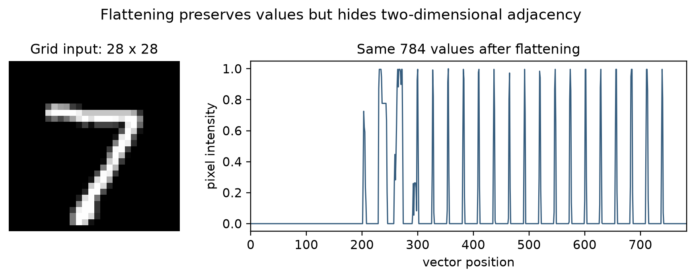
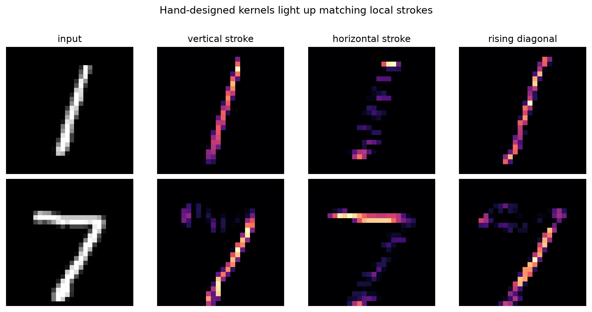
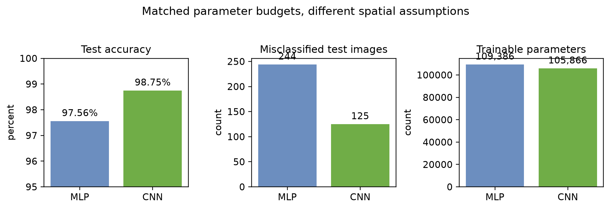
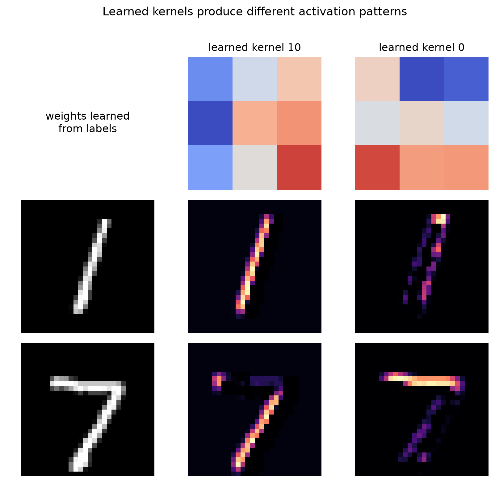

# Convolutional Neural Networks: Learning Spatial Structure {#ch-cnn}

An image is numerical data, but it is not merely a list of numbers. A pixel's
meaning depends partly on the pixels around it. A short dark stroke beside
another short dark stroke may form a corner; several corners may form a digit;
and several parts may form an object. A useful image model should preserve this
spatial structure long enough to learn from it.

The [classification chapter](07-classification.qmd) introduced multilayer neural
networks as nonlinear classifiers. This chapter changes the *architecture* of
that network to match image data. A **convolutional neural network** (CNN) uses
small, shared sets of weights to find local patterns wherever they occur. The
same ideas apply to other grid-like data, but images provide the clearest
introduction.

By the end of the chapter, you should be able to:

- explain why immediately flattening an image discards useful assumptions;
- calculate a two-dimensional cross-correlation with a small kernel;
- track height, width, and channels through convolution and pooling layers;
- calculate output sizes and parameter counts; and
- explain what a CNN learns and how its learned features support classification.

## Why Image Structure Changes the Model {#sec-cnn-why}

Consider an MNIST image: a $28\times28$ grid of grayscale values. A multilayer
perceptron (MLP) reshapes that grid into a vector of length $784$ before applying
a dense layer. This is a valid baseline, but the reshaping removes the model's
direct knowledge that two values were neighbors in the original image.

Flattening does not erase pixel values. It erases the *geometry encoded by their
arrangement*. The dense layer can still learn spatial relations, but it must
learn each relation through separate weights. A stroke near the upper-left and
the same stroke near the lower-right reach different input positions and
therefore different weights.

{#fig-cnn-flattening fig-alt="A digit seven appears on a 28 by 28 image grid at left and as a line plot of 784 pixel intensities at right." width="88%"}

A CNN introduces two useful assumptions:

1. **Locality.** Nearby values are especially likely to form a meaningful
   pattern, so an early unit can examine a small neighborhood instead of the
   entire image.
2. **Weight sharing.** A useful pattern can matter in more than one location, so
   the same detector can scan across the image.

These assumptions are an **inductive bias**: a deliberate restriction that helps
the learner when it agrees with the data. A dense network asks, "Which input
position connects to which hidden unit?" A convolutional layer asks, "Does this
small pattern occur here?" CNNs were developed into effective systems for
handwritten-document recognition well before the present deep-learning era
[@LeCun:1998], and locality and weight sharing remain their defining ideas
[@Zhang:2023].

::: {.callout-tip title="Put it into practice"}
Establish the comparison point in [Part I of the CNN practicum](../practice/09a-convolutional-neural-networks.qmd#sec-pr-cnn-mlp),
then explain what information the flattening step retains and what structural
assumption it removes.
:::

## Images as Tensors {#sec-cnn-tensors}

We will describe shapes in **channels-last** order because that is the default in
the accompanying Keras labs:

| Object | One example | A batch of $B$ examples |
|---|---:|---:|
| Grayscale image | $H\times W\times1$ | $B\times H\times W\times1$ |
| RGB color image | $H\times W\times3$ | $B\times H\times W\times3$ |
| Feature maps inside a CNN | $H\times W\times C$ | $B\times H\times W\times C$ |

Here $H$ is height, $W$ is width, and $C$ is the number of channels. The batch
axis says how many examples are processed together; it does not describe one
image.

The word *channel* needs care. An RGB image has three input channels because
each pixel has red, green, and blue values. A convolutional layer may produce
dozens of output channels, each recording the response of a different learned
filter. Channels coexist within one layer; they are not separate network layers.

For MNIST, one raw example has shape $28\times28$. We explicitly add a channel
axis to obtain $28\times28\times1$. The numerical values have not changed; the
shape now states that there is one value at each spatial position.

::: {.callout-tip title="Put it into practice"}
Use the [CNN practicum setup](../practice/09a-convolutional-neural-networks.qmd#sec-pr-cnn-setup)
to diagnose several common shape errors before a framework reports them.
:::

## A Kernel as a Small Shared Detector {#sec-cnn-kernel}

A **kernel** or **filter** is a small array of weights. It moves across an input,
one local window at a time. At each location, we multiply corresponding input
and kernel entries and add the products. The resulting number reports how
strongly that local window matches the kernel.

For a single-channel input $\mathbf{X}$ and a kernel $\mathbf{K}$, the operation
used by most deep-learning libraries is

$$
Y_{i,j}=b+\sum_{u=0}^{K_h-1}\sum_{v=0}^{K_w-1}
K_{u,v}X_{i+u,j+v},
$$ {#eq-cnn-cross-correlation}

where $b$ is a learned bias. Strict mathematical convolution flips the kernel
before sliding it. Equation @eq-cnn-cross-correlation does not, so it is formally
**cross-correlation**. Deep-learning practice nevertheless calls the layer a
convolutional layer. Because its weights are learned, the distinction does not
limit what pattern the layer can learn.

### A Complete Small Example {#sec-cnn-kernel-example}

Let the $4\times4$ input be

$$
\mathbf{X}=\begin{bmatrix}
1&1&0&0\\
1&1&0&0\\
1&1&0&0\\
1&1&0&0
\end{bmatrix},
\qquad
\mathbf{K}=\begin{bmatrix}
1&-1\\
1&-1
\end{bmatrix}.
$$

The kernel gives a large positive response where a light region changes to a
dark region from left to right. At the first position, the window is all ones,
so the response is

$$1(1)+1(-1)+1(1)+1(-1)=0.$$

One step to the right, the window crosses the boundary:

$$1(1)+0(-1)+1(1)+0(-1)=2.$$

Sliding over every valid position produces the **feature map**

$$
\mathbf{Y}=\begin{bmatrix}
0&2&0\\
0&2&0\\
0&2&0
\end{bmatrix}.
$$

The vertical line of twos marks the detected boundary. Notice the economy: the
same four weights were used at all nine output positions. In a trained CNN we
usually do not hand-design these values. Backpropagation adjusts them to reduce
the task loss, just as it adjusts dense-layer weights. An activation such as
ReLU, $\max(0,Y_{i,j})$, is then commonly applied to introduce nonlinearity.

Hand-designed kernels are nevertheless useful for learning. In
@fig-cnn-hand-kernel-response, vertical, horizontal, and diagonal kernels
produce bright responses where a local stroke agrees with their weights. The
same kernel responds at multiple positions because its weights are shared.

{#fig-cnn-hand-kernel-response fig-alt="Rows for handwritten digits one and seven show feature maps from vertical, horizontal, and diagonal kernels." width="96%"}

A crucial caution follows from the figure: several kernels respond to parts of
both digits. One filter reports local evidence; it does not decide the class.
Classification emerges from combining many feature maps across layers.

::: {.callout-tip title="Put it into practice"}
Reproduce every number, alter the input and filter, and write a general NumPy
implementation in [Part II of the CNN practicum](../practice/09a-convolutional-neural-networks.qmd#sec-pr-cnn-cross-correlation).
:::

## Padding, Stride, and Output Size {#sec-cnn-output-shape}

Three choices determine how the kernel moves and how large the feature map is:

- **Kernel size** $(K_h,K_w)$ controls the local window.
- **Padding** $(P_h,P_w)$ adds values, usually zeros, around the boundary.
- **Stride** $(S_h,S_w)$ controls how many positions the window moves at a time.

With unit dilation, the output height and width are

$$
H_{out}=\left\lfloor\frac{H+2P_h-K_h}{S_h}\right\rfloor+1,
\qquad
W_{out}=\left\lfloor\frac{W+2P_w-K_w}{S_w}\right\rfloor+1.
$$ {#eq-cnn-output-shape}

For a $28\times28$ image, a $3\times3$ kernel, no padding, and stride $1$,
the result is $26\times26$. Adding one row or column of padding on each side
gives $28\times28$. Frameworks call these choices `padding="valid"` and
`padding="same"`, respectively, when stride is one.

A larger stride reduces resolution because the layer visits fewer windows. For
the same $28\times28$ input, $3\times3$ kernel, padding $1$, and stride $2$,
Equation @eq-cnn-output-shape gives $14\times14$. This reduction saves
computation, but it also discards spatial detail. Output-shape arithmetic is
therefore part of model design, not merely bookkeeping.

::: {.callout-tip title="Put it into practice"}
Predict the output before running the code in [Part II of the CNN practicum](../practice/09a-convolutional-neural-networks.qmd#sec-pr-cnn-concepts),
then use assertions to check the formula.
:::

## From One Channel to Many Features {#sec-cnn-channels}

A filter must span all input channels. For an input with $C_{in}$ channels, one
filter has shape $K_h\times K_w\times C_{in}$. Its responses across those
channels are summed, so one filter produces one two-dimensional feature map.
Using $C_{out}$ different filters produces $C_{out}$ output channels:

$$
Y_{i,j,d}=b_d+
\sum_{u=0}^{K_h-1}\sum_{v=0}^{K_w-1}\sum_{c=0}^{C_{in}-1}
K_{u,v,c,d}X_{i+u,j+v,c}.
$$ {#eq-cnn-multichannel}

The full kernel bank therefore has shape
$K_h\times K_w\times C_{in}\times C_{out}$. Including one bias for each
output channel, its parameter count is

$$
(K_hK_wC_{in}+1)C_{out}.
$$ {#eq-cnn-parameters}

Suppose a $28\times28\times1$ image enters a layer with 16 same-padded
$3\times3$ filters. The output is $28\times28\times16$, and the layer learns
$(3\cdot3\cdot1+1)16=160$ parameters. A following layer with 32 filters sees
all 16 incoming feature maps. Its output has 32 channels, and it learns
$(3\cdot3\cdot16+1)32=4,640$ parameters.

This resolves a common confusion:

- the number of **input channels** determines each filter's depth;
- the number of **filters** determines the number of output channels; and
- the number of **layers** tells us how many transformations are composed.

::: {.callout-tip title="Put it into practice"}
Track channels and verify parameter counts in [Part II of the CNN practicum](../practice/09a-convolutional-neural-networks.qmd#sec-pr-cnn-pooling),
then verify the parameter count against a Keras model summary.
:::

## Pooling and Growing Receptive Fields {#sec-cnn-pooling}

A pooling layer summarizes each local window without learning kernel weights.
**Max pooling** keeps the largest activation; **average pooling** keeps the
mean. With a $2\times2$ window and stride $2$, a $28\times28$ feature map
becomes $14\times14$.

Pooling has two practical effects. It lowers the cost of later layers, and it
makes their representations less sensitive to small changes in feature
location. This is useful stability, but it is not perfect invariance: moving or
changing an input can still change the result, especially near a pooling
boundary. Aggressive pooling can also erase small but important details.

The **receptive field** of an activation is the region of the original input
that could affect it. One $3\times3$ layer sees a $3\times3$ neighborhood. Two
stride-one $3\times3$ layers compose information from a $5\times5$ region.
Deeper layers can therefore combine short strokes into corners, corners into
parts, and parts into larger patterns. This hierarchy is the main conceptual
reason to stack convolutional layers.

::: {.callout-tip title="Put it into practice"}
Compare convolution and max pooling on the same feature map in
[Part II of the CNN practicum](../practice/09a-convolutional-neural-networks.qmd#sec-pr-cnn-pooling),
including a case where pooling removes useful detail.
:::

## From Feature Maps to a Class Prediction {#sec-cnn-classifier}

A small image classifier usually has two conceptual blocks:

1. a **feature extractor** made of convolution, activation, and downsampling;
2. a **classification head** that converts the learned representation into
   class scores.

The following compact MNIST model will be used in the companion labs. `same`
padding keeps the spatial size during convolution, and each $2\times2$ pooling
layer halves it.

{#fig-cnn-pipeline fig-alt="An MNIST image of shape 28 by 28 by 1 flows through convolution, pooling, another convolution and pooling stage, flattening, a dense layer, and ten class outputs. Spatial size decreases while feature channels increase." width="100%"}

| Stage | Output shape | Trainable parameters |
|---|---:|---:|
| Input | $28\times28\times1$ | 0 |
| 16 filters, $3\times3$, ReLU | $28\times28\times16$ | 160 |
| Max pool, $2\times2$ | $14\times14\times16$ | 0 |
| 32 filters, $3\times3$, ReLU | $14\times14\times32$ | 4,640 |
| Max pool, $2\times2$ | $7\times7\times32$ | 0 |
| Flatten | 1,568 | 0 |
| Dense, 64 units, ReLU | 64 | 100,416 |
| Dense, 10 units, softmax | 10 | 650 |
| **Total** |  | **105,866** |

The final dense layer produces one score per digit. Softmax converts the scores
to a probability distribution, and multiclass cross-entropy measures the loss.
Backpropagation carries the resulting error through the dense head and the
convolutional feature extractor. Thus a filter is not rewarded for looking like
an edge detector; it is rewarded when its responses help the whole model predict
the correct label.

The corresponding MLP lab uses $784\rightarrow128\rightarrow64\rightarrow10$,
or 109,386 parameters. The two models are similar in size. If their behavior
differs, the comparison highlights architectural bias rather than simply giving
one model a much larger parameter budget.

In one controlled full-MNIST run of the companion practicum, the MLP reached
97.56% test accuracy and made 244 errors; the CNN reached 98.75% and made 125
errors. The CNN therefore reduced the observed error count by 119, or about 49%,
while using slightly fewer parameters. This is a case study, not a universal
performance guarantee, but it is consistent with the benefit of matching the
architecture to image structure.

{#fig-cnn-observed-results fig-alt="Bar charts show higher test accuracy and fewer errors for the CNN, while the two models have similar parameter counts." width="92%"}

Dropout, early stopping, and validation curves help diagnose overfitting, but
they do not replace a final evaluation on untouched test data. These issues are
developed further in [Generalization, Model Selection, and Fit](15-generalization.qmd#ch-generalization).
In the matched run above, training loss kept falling after validation loss
reached its minimum for both models. That divergence is stronger evidence of
overfitting than training accuracy by itself; the companion practicum plots and
interprets the complete curves.

::: {.callout-tip title="Put it into practice"}
Train both models under a shared protocol in [Part I and Part III of the CNN
practicum](../practice/09a-convolutional-neural-networks.qmd#sec-pr-cnn-results),
then compare accuracy, parameter count, learning curves, errors, and training
cost.
:::

## Looking Inside and Knowing the Limits {#sec-cnn-interpretation}

The output of each filter is observable. We can pass an image through a trained
model and plot selected feature maps. Early maps often respond to simple local
changes; deeper maps combine earlier responses and are harder to name. Such
plots are useful evidence about model behavior, but a bright activation is not
automatically a human-interpretable explanation.

@fig-cnn-learned-maps compares two learned first-layer kernels on examples of 1
and 7. The channels were selected using their *average relative activation*
across all test examples of those two classes, rather than because one image
looked persuasive. Even then, neither map is a literal "1 detector" or "7
detector." Each is one component of a distributed representation.

{#fig-cnn-learned-maps fig-alt="Two learned three by three kernels appear above activation heatmaps for a digit one and a digit seven." width="68%"}

CNNs are also not universally appropriate. Their local, shared filters work
well when the same kind of nearby pattern can matter across locations. They are
less natural when every feature position has a permanently different meaning,
as in some tabular problems. Standard convolution is translation *equivariant*:
shifting an input tends to shift its feature map. Pooling and final aggregation
may add some stability, but the complete classifier is not guaranteed to ignore
all translations, rotations, scale changes, or background shifts.

Useful extensions include data augmentation, residual connections, and transfer
learning from a pretrained feature extractor. These can greatly expand a CNN's
reach, but they do not change the central lesson of this chapter: architecture
encodes assumptions about the structure of the data.

::: {.callout-tip title="Put it into practice"}
Inspect hand-designed kernels, learned feature maps, and representative mistakes
in [Part IV of the CNN practicum](../practice/09a-convolutional-neural-networks.qmd#sec-pr-cnn-activations).
State what each visualization supports and what it does not prove.
:::

## Summary {#sec-cnn-summary}

- An MLP can classify images, but immediate flattening does not directly exploit
  spatial neighborhoods.
- A convolutional layer applies a small shared kernel across locations. The
  library operation is usually cross-correlation, though it is called convolution.
- Padding, stride, and kernel size determine spatial output dimensions.
- Each filter spans all input channels and produces one output channel.
- Pooling reduces resolution, while stacked layers grow receptive fields and
  combine simple local patterns into larger ones.
- CNN filters are learned end to end from the task loss; they are not normally
  prescribed by hand.
- A fair MLP-versus-CNN comparison controls the data split, training protocol,
  evaluation procedure, and approximate parameter budget.

## Exercises {#sec-cnn-exercises}

1. Apply the kernel in @sec-cnn-kernel-example after transposing only the input.
   Then transpose only the kernel. Explain why these are different experiments.
2. Find the output shape for a $32\times32\times3$ input, 24 filters of size
   $5\times5$, padding 2, and stride 2. Count the trainable parameters.
3. A layer receives 12 input channels and produces 20 output channels. How many
   separate two-dimensional kernel slices are learned for a $3\times3$ layer?
4. Compare two successive $3\times3$ stride-one convolutions with one
   $5\times5$ convolution. What receptive field do they share, and how do their
   nonlinearities and parameter counts differ?
5. Give one task for which translation equivariance is useful and one for which
   absolute position should matter. Explain how that changes your model design.
