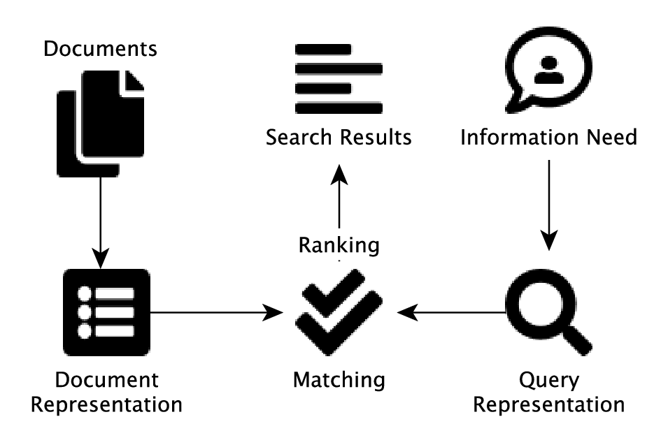
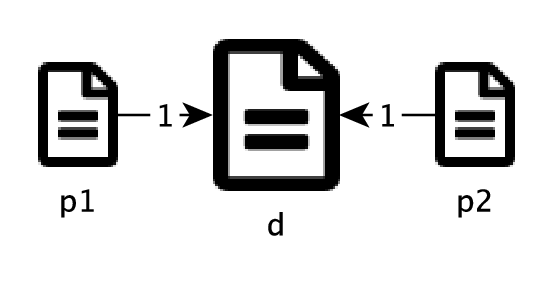

# Search and Retrieval {#ch-search}

::: epigraph
Ask, and it shall be given you; seek, and you shall find; knock, and it
shall be opened to you.

*The Gospel of Matthew*
:::

We are in constant pursuit of information, knowledge, and truth. We have
questions and we ask. Today, we ask questions and seek information with
the help of technologies. We search for information and web pages by
Googling. We pose questions to digital assistants such as Amazon's
Alexa. Regardless of differences in the specifics, the essence of these
interactions is to find the right (relevant) piece of information that
can satisfy us (the user) -- be it a web page, a short answer, a
prediction or some kind of recommendation.

This is about search and the general area of research is commonly
referred to as *Information Retrieval*. In 1951 -- when searches for
information were primarily conducted in the libraries with the
assistance of reference librarians without a computer -- Calvin Mooers
coined the term *Information Retrieval* as \"the investigation of
information description and specification for search and techniques for
search operations.\"[@Mooers1951IR] A library catalog with index cards
was the state of the art to help people seek and find quickly.

With the support of computers, we can perform the same type of search
tasks even more efficiently, yet with ease on the user's side and
sophistication on the system's side. Now that computers are essential to
the various search systems we have in place, the notion of *Information
Retrieval* (IR) may be redefined, in a narrower sense,
as:[@Manning2008IIR]

::: displayquote
finding material (usually documents) of an unstructured nature (usually
text) that satisfies an information need from within large collections
(usually stored on computers)
:::

With this narrower definition, a basic task of IR is, given a user
query, to find *relevant* documents from a collection of text materials.
Traditionally, the data collection such as a library of books is assumed
to be static, and certain pre-computation and indexing can be conducted
before querying processing. In reality, this assumption does rarely hold
as data can grow to include new materials which in turn should be
incorporated into the index.

Web search engines are *Information Retrieval* (IR) systems and the Web
is a huge collection of data that constantly grow and change. The
magnitude, dynamics, and decentralization of data on the Web pose great
challenges, which have led to waves of innovation on Web IR[^ch12-1]. We will
discuss some of these challenges and related ideas later in the chapter.

## Basic Paradigm

In information retrieval, the basic problem is to search and find
matched documents against a query representation based on a user's
information need. Documents need to be stored in proper representation
so that related matches can be computed (numerically). An index is also
necessary to conduct the matching process timely.

As shown in @fig-ir, the user with an information need issues a query to
the retrieval system, which in turn match it against the document
representation in the store to identify relevant documents in the search
result. The result can also be ranked (sorted) in terms of predicted
relevance of each document.

{#fig-ir fig-alt="Basic paradigm of an Information Retrieval system" width="3.5in"}

The notion of *relevance* is key in information retrieval research. Yet
it remains one of the least understood concepts in the field. Whether a
piece of information is relevant depends on many factors such as the
user's objectives and the context of the current task. Sometimes, these
may be difficult for the user to articulate; and even if she does, the
query expression thus constructed may hardly be precise.

Retrieval systems have to attack the issue of uncertainty often
associated with understanding the user's need and what is truly relevant
in context. We can factor this in when building a retrieval model. With
probabilistic models, for example, the degree of uncertainty can be
quantified for proper probabilistic ranking in light of probability and
information theories.

However, uncertainty is often due to lack of information (data) and
requires further data collection. Techniques that support relevance
feedback and interactive, exploratory searching may help engage the user
in order to understand more precisely what she is looking for.

<!-- practice-link:start -->
::: {.callout-tip collapse="true" title="Put it into practice"}
Continue with [the corresponding practice activity](../practice/12-search-and-retrieval.qmd#sec-pr-12-basic-paradigm)
to turn **Basic Paradigm** into a calculation,
implementation, visualization, diagnostic, or interpretation task.
:::
<!-- practice-link:end -->

## Indexing

For now, let's assume the basic model presented in
@fig-ir and walk
through some of the major ideas for finding matched (and potentially
relevant) documents.

In @fig-ir, the
data collection can be very large with a great number of documents, e.g.
a library of a million books. In order to conduct searches with matching
and ranking responsively, some amount of data pre-processing is
necessary. This is also practically sensible if the collection is
relatively static (no dramatic changes frequently).

In chapter , we discuss basic processes for text vectorization. The
result of vectorizing a text collection can be represented by a matrix
with documents as rows and terms as columns. Each document here is a
vector of values corresponding to terms in the dictionary. These values
can be obtained using methods such as binary, term frequency (TF), or
TF\*IDF term weighting scheme.

Assume we start with the binary representation, which is very simple
with $0$s and $1$s, for a collection of $1,000$ documents each
containing a dozen words. In terms of the Heaps' law, we probably obtain
somewhere close to $1,000$ unique terms, leading to a large matrix in
the order of million values. With an even larger collection, the entire
matrix representation can become too expensive to be stored and
computed.[^ch12-2]

Now if we examine actual values of each document (row) in the matrix, we
will quickly realize that most values are $0$ (zero). This is due to the
fact that even though we have a larger number of unique terms in the
entire collection -- thus many columns in the matrix -- each document
(row) only contains a small number of these terms. So instead of storing
the entire matrix with all values, we can use a *Sparse Matrix*
representation where only non-zero values are stored.

On the document level, this means each document is a *Sparse Vector*
that only stores data about what terms actually appear in it. With the
sparse representation, we can significantly reduce the amount of storage
needed for document representation (i.e. better space efficiency).

However, the use of sparse vectors does not necessarily address the
issue of query processing efficiency. That is, even with document sparse
vectors, it still requires lots of computational effort on the system
side to sift through all documents to find matches for a query. The
amount of time to perform this matching task increases linearly with the
increasing number of the documents. For searching a very large data
collection such as the Web, this will become too slow to serve users on
the fly.

Efficient query processing requires a better data structure that
supports: 1) fast lookup of individual query terms with their associated
documents, and 2) fast merging of all terms in the query expression. The
1st objective can be achieved if the terms are sorted where a binary
search can be performed. Each of the terms on the sorted list can then
point to the list of documents (using their IDs) containing it. We refer
to such a sorted structure of terms with references to documents as an
*Inverted Index*. Each term is now a vector of document IDs, inverted
from the original document vectors of terms.

When presented with a single-term query, the system can conduct a binary
search to quickly identify all documents matching (containing) the term
from the inverted index. With a query expression of multiple terms, each
term can be looked up in the same manner.

But how can we merge documents associated with the individual terms to
find out which documents actually satisfy the entire query, where,
either explicitly or implicitly, terms are used in a logical context
with AND, OR, and/or NOT?

To achieve the 2nd objective of fast merging, documents for each term in
the inverted index should also be sorted (by their IDs). So in the end
when an inverted index is built, all the terms will be sorted, each of
which in turn contains a list of sorted document IDs. In the next
section, we will look at a couple of methods to see how we can take
advantage of the sorted lists to merge query terms for document-query
matching.

<!-- practice-link:start -->
::: {.callout-tip collapse="true" title="Put it into practice"}
Continue with [the corresponding practice activity](../practice/12-search-and-retrieval.qmd#sec-pr-12-indexing)
to turn **Indexing** into a calculation,
implementation, visualization, diagnostic, or interpretation task.
:::
<!-- practice-link:end -->

## Matching {#ch-ir-match}

One who is interested in reading about the U.S. revolution may issue a
query \"*The Declaration of Independence*\" on a collection of
historical artifacts to find that particular document. If we assume the
system treats words *the* and *of* as stop-words, they will be
disregarded in the query processing. In this case, the query has two
terms, namely *Declaration* and *Independence*, which can be further
interpreted as *Declaration* AND *Independence* assuming the user is
looking for both terms.

Given an inverted index with a sorted list of all unique terms in the
collection, it takes binary search logarithmic time to find each term's
entry. That is, given $M$ terms in the index, the system makes
$O(\log{M})$ comparisons to find *Declaration* and *Independence* in the
worse case. This is logarithmic time complexity is rather efficient and
scalable. An example of the two term entries found in the inverted index
may look like this:

{#fig-ir-postings fig-alt="Two postings from the inverted index. Highlighted document IDs with double border indicate matched documents that satisfy Declaration AND Independence." width="70%"}

We now refer to each term's list of documents -- in fact only their IDs
-- as the *posting* of the term. An inverted index is thus a collection
of *postings*. After examining the two postings, we can conclude that
documents $\#2$, $\#103$, and $\#456$ in @fig-ir-postings contain both terms. But how can an
algorithm merge the two postings to identify these matched documents?

A very simple approach is to go through the documents IDs in the posting
for term *Declaration* and, for each of them, we compare it with every
document ID in the second posting for term *Independence*. Suppose the
first posting has $n_1$ documents and the second has $n_2$, this will
conduct $n_1 \cdot n_2$ comparisons. This approach is going to be very
slow with large postings and it has yet to take advantage of the sorting
(pre-computation) that has been performed on the document IDs.

Apparently, we can improve on the above brute force method is by
conducting a binary search on the second posting for each document on
the first posting. In this case, the time complexity of the matching
process will become $O(n_1 \log n_2)$ as the binary search is of
$O(\log n_2)$ complexity. Assume $n_2 > n_1$ is a large number, this
will significantly reduce query processing time.

So far we have used one posting as the primary to iterate through and,
in the process, compare each value there to those in the second posting.
In this approach, the two postings play unequal roles in the matching
process.

A different approach is to take the postings equally and iterate through
them simultaneously. Assuming document IDs are sorted in the ascending
order, we start at the beginning of each posting. In each step, we
compare the current values of the two postings and the one with a small
value will move to the next (greater) value. This continues until it has
been found a value greater or equal to the current value of the other
posting. In that case, we switch to the other posting to go next.

For the above example, we start at first document ID in each posting
shown in @fig-ir-matching, where the *Declaration* posting has a
value $2$ and the *Independence* posting has $1$ (see step 1 in the
figure). As the one with a smaller document ID, the *Independence*
posting will move to the next document ID, which is $2$ and matches the
the current value in *Declaration* (see step 2).

{#fig-ir-matching fig-alt="Simultaneous walking to merge postings, starting at the first document ID. The posting with the smaller value will move to the next ID." width="70%"}

Now that the second posting (*Independence*) is already with an equal or
greater document ID, the process will shift to the first posting
(*Declaration*) to catch up, which, as shown in
@fig-ir-matching step 3, then goes to document $\#3$ and
switches the turn back as it surpasses $2$. This process will continue
until no more matches can possibly be found.

In the worse case scenario, it iterates through the two postings from
start to end, which is $O(n_1 + n_2)$ time complexity. Practically, this
is better than the previous method with $O(n_1 \log n_2)$ complexity
where $\log n_2$ may remain a large number ($\gg 2$).

These techniques are particularly useful to merge postings for logical
AND, i.e. for document containing both or all query terms. They also
work well with the OR query expressions, where documents containing any
of the terms should be brought together after the removal of duplicate
IDs.

The simultaneous iterative process can be further improved with skip
pointers that the iterations faster by skipping a significant amount of
document IDs in each posting. However, the skip pointers technique is of
little use for OR queries as it skips documents that should be included
with a logical OR.

<!-- practice-link:start -->
::: {.callout-tip collapse="true" title="Put it into practice"}
Continue with [the corresponding practice activity](../practice/12-search-and-retrieval.qmd#sec-pr-12-matching)
to turn **Matching** into a calculation,
implementation, visualization, diagnostic, or interpretation task.
:::
<!-- practice-link:end -->

## Ranking

With techniques presented in the previous section, we know how to
process a query with an inverted index and identify matched documents by
merging postings for the query terms. This can be conducted rather
efficiently if proper preprocessing is already in place, e.g. with
sorting and skip pointers.

If the user can articulate her need for information with relevant query
terms in a precise boolean expression, then the system should be able to
serve the user's need via matching. There is potentially a long list of
documents that match the query. In the old days, this perhaps worked
just fine for scholars who would like to find a list of research
publications for a comprehensive literature review.

In the context of today's World Wide Web and online social media, it
will not be helpful by retrieving an extremely long list of pages and
presenting them all at once to the user. For one, the query expression
of any ordinary user is most likely imprecise and a lot of matched
documents will turn out to be non-relevant.

More important, many information seekers on the web are not looking for
comprehensive literature. Often they are in need of the one page, if not
a few, that can satisfy their need or at least something they can start
with. In these cases, the challenge is not about the thoroughness of the
result, but how precise and relevant the result is.

The common practice of today's web search engines is to present a ranked
list of matched documents where, ideally, the most relevant documents
will appear early on so the user can see them and follow with a
clickthrough. So in addition to query matching, document ranking
(sorting) in the retrieved result is essential for the success of a
search engine.

### Content-based Ranking

So in what order shall we rank documents or pages according to a query?
Among the matched ones, what documents should be presented to the user
early in the result?

As the key to *information retrieval* (IR) is relevance, the first
reaction to the questions here is to rank documents according to how
*relevant* they are to the query. But how do we quantify relevance?
Without the user's subjective feedback on what is relevant vs. what is
not, there is simply no data to quantify relevance. The alternative is
to assume that documents that match the user's query expression to a
higher degree are more relevant to her information need.

Based on this assumption, there are several approaches we can take. For
example, using the *Term Frequency* (TF) scheme discussed in chapter ,
we can count the total number of query term occurrences in each
document. The matching score of a document $d$ with regard to query $q$
can be therefore computed by:

$$\begin{aligned}
score(q,d) & = & \sum_{t \in q \cap d} TF_{t,d}
\end{aligned}$$

where $t$ is each term appearing in both the query and the document, and
$TF_{t,d}$ is the term frequency of $t$ in $d$, i.e. the number of times
it appears in the document.

Now one would argue that this scoring function will not work well as it
give equal importance to each query term. With this method, one who
issues a query like \"the declaration\" may retrieve a bunch of
documents with lots of \"the\" in the writing (suppose \"the\" has not
been removed as a stop-word from being indexed). We may therefore
consider the relevance of individual terms by replacing the TF with
TF-IDF weights (Term Frequency \* Inverse Document Frequency):

$$\begin{aligned}
score(q,d)
% & = & \sum_{t \in q \cap d} w_{t,d} \\
& = & \sum_{t \in q \cap d} TF_{t,d} \cdot IDF_{t}
\end{aligned}$$

where $IDF_t$ is IDF weight of term $t$.

Both TF and TF-IDF scoring functions above are dependent on the terms'
occurrences. Apparently, longer documents (e.g. books) are more likely
to contain more instances of the same terms than the shorter documents.
To remedy for this bias, one can normalize term frequency by the
document length:

$$\begin{aligned}
score(q,d)
& = & \sum_{t \in q \cap d} \frac{TF_{t,d}}{L_d} \cdot IDF_{t}
\end{aligned}$$

where $L_d$ is the length of document $d$, i.e. the number of terms in
the documents including duplicates. Now that we factor in document
length, short documents will have *equal* chances to be ranked and long
documents will no longer dominate[^ch12-3]. After all, for any document $d$,
$\sum_t \frac{TF_{t,d}}{L_d} = 1$ regardless of its length. This is
after the fact that the overall probability of *any term* drawn from the
document is always $1$.

The document-length-normalized TF is a a probability estimate. Imagine
if we put all the terms of document $d$ in a black box and randomly draw
a term from it, the likelihood of getting term $t$ can be estimated by
$\frac{TF_{t,d}}{L_d}$. The length-normalized scoring function here is
essentially modeled on the probability of each query term's occurrence
in the document.

Like document-length normalized TF, IDF is also based on a probability
estimate. As discussed in chapter , a term's IDF weight is also a
measure based on the term's likelihood to appear in any document drawn
randomly from the entire data collection. The component $\frac{n_t}{N}$
in the IDF function, where $N$ is the total number of documents and
$n_t$ the number of documents containing term $t$, is to estimate the
term's collection-wide probability. The logarithmic transformation:
$$\begin{aligned}
IDF_t
& = & -\log{\frac{n_t}{N}} \\
& = & \log{\frac{N}{n_t}}
\end{aligned}$$

does convert dramatically varied probability values into a more
comparable scale and dampens their differences. However, this
formulation is not accidental but has in fact a concrete theoretical
root in the information theory. $IDF_t$ can be derived from measuring
the amount of *relative entropy* (KL divergence) when term $t$ is
observed in a document from the collection.[@Aizawa2003IDF]

In light of uncertainties involved in understanding user needs to
quantify relevance, one may also think of ranking documents in terms of
the *probability of relevance*. Indeed, early probabilistic IR research
followed the *Probability Ranking Principle* (PRP), which states that
documents should be ranked in order of the probability of relevance, or
how likely documents will be useful to the user.[@Robertson1977PRP] The
principle can be operationalized by estimating those probability from
data, e.g. data on term distributions and user relevance feedback.

Based on PRP and a logarithmic transformation of the Bayes rule, one can
model the odds of a document's relevance given a query and derive a
weighting function similar to IDF. This is known as the *Binary
Independence Model* (BIM), where the notion of relevance is binary
(either relevant or not relevant)[^ch12-4] and documents are assumed to be
independent of one another [@Robertson1976BIM]. The relevance weight
$w^{RSJ}_t$[^ch12-5] of a term $t$ in BIM is computed by:

$$\begin{aligned}
w^{RSJ}_t
& = & \log{\frac{(r_t + 0.5)(N - R - n_t + r_t + 0.5)}{(n_t - r_t + 0.5)(R - r_t + 0.5)}}
\end{aligned}$$

where $R$ is the number of relevant documents, $n_t$ is document
frequency of term $t$, and $r_t$ is the number of *relevant* ones in the
$n_t$ documents. The weight approximates IDF when both the number of
relevant documents $r_t$ is much fewer $n_t$, which in turn is much
smaller compared to the entire collection $N$. That is,
$w^{RSJ}_t \approx IDF_t$ when $r_t \ll n_t \ll N$.

Further development of this probabilistic model led to another
well-known method called *BM25*[@Robertson2009PRF], where a term's
weight is computed by:

$$\begin{aligned}
w^{BM25}_{t,d}
& = &
\frac{TF_{t,d}}{k_1(1-b)+b\frac{L_d}{\bar{L}}+TF_{t,d}}
\cdot w^{RSJ}_t
\end{aligned}$$

where $\bar{L}$ is the average document length in the collection, and
$k_1$ and $b$ are parameters to be optimized (tuned) through
experiments. $b$ adjusts the degree of document normalization, with full
normalization at $b=1$ and no normalization at $b=0$. This highly
resembles TF\*IDF, where $w^{RSJ}_t$ corresponds to $IDF_t$ and the rest
of the formula is $TF_{t,d}$ with document-length normalization. The
scoring (ranking) function for BM25 is then the sum of term weights:

$$\begin{aligned}
score(q,d) & = & \sum_{t \in q \cap d} w^{BM25}_{t,d}
\end{aligned}$$

<!-- practice-link:start -->
::: {.callout-tip collapse="true" title="Put it into practice"}
Continue with [the corresponding practice activity](../practice/12-search-and-retrieval.qmd#sec-pr-12-content-based-ranking)
to turn **Content-based Ranking** into a calculation,
implementation, visualization, diagnostic, or interpretation task.
:::
<!-- practice-link:end -->

### Popularity-based Ranking

With document ranking methods such as those based on TF\*IDF and BM25,
an *information retrieval* system will be able to sort documents
according to their match scores, especially in terms of important
keywords in the user query. This worked well in the traditional library
context, where documents were in fact selected publications such as
books and articles. Because of the editorial processes these
publications went through, the contents of the documents were
trustworthy in general. Ranking based on document content is a sensible
solution in that setting.

When the World Wide Web started to grow in the 1990s, the first
generation of web search engines adopted the same technologies developed
in the libraries and continued to rely on text contents in their
ranking. It soon became clear that this is easily susceptible to
spamming.

The Web is a decentralized space for publication without a central
editorial process. Everyone is a publisher who writes anything he wants,
in his own way of expression. A ranking method based on TF\*IDF, for
example, is impacted by TF and IDF. You probably can exert very little
influence on the IDF part as it is a *global* statistic of the entire
web collection. However, if you want to be ranked number one for queries
like \"The Declaration of Independence,\" you simply repeat those
keywords in your page contents.

By simple repetition in the text, you increase the terms' frequencies
(TFs) and therefore the ranking of your page to related queries. The
point here is that page contents on the web are not necessarily
trustworthy and we cannot simply rely on the *claims* of authors in this
rather decentralized, autonomous environment.

Without a central authority that we can trust on individual pages, we
may perhaps consider input from their *peers* -- those who know these
pages and what they have to say about them. On the web, pages reference
one another via *hyperlinks*.
@fig-hlinks shows an example of a web page, from which the
user can click on a label (text), a button, or an image to visit another
page.

::: marginfigure
{#fig-hlinks fig-alt="Page references via hyperlinks from page A to pages B and C" width="2in"}
:::

With hyperlinks, we pages form a directed network on which structural
analysis can be performed. And when a text label (i.e. anchor text) is
provided as part of the hyperlink, it provides useful data about what
the target page is about.

In @fig-hlinks, when page A links to page B, descriptions or
keywords page A uses on the hyperlink can be considered for the
representation of page B. Assuming the pages are on different web sites
with separate ownership, then this piece of anchor text represents an
independent evaluation of page B's contents. By aggregating anchor text
data from all other pages linking to page B, its inverted index can be
adjusted with the crowd-sourced data, which are potentially more
reliable than self-claimed page contents.[^ch12-6]

Based on the classic BM25, BM25F is an example of related methods that
go beyond the body text of a web page to include other structural
elements (fields) and relevant data streams (particularly anchor text
data).[@Zaragoza2004BM25F] Among others, the use of anchor text data for
indexing and matching is a common practice of web search engines.

When the user issues a search query, the question remains what is more
*relevant* and should be ranked higher in the result. For web searches,
*relevance* does not merely mean *on-topic* because a very large number
of pages will be considered on topic in terms of their contents (anchor
text included). The notion of *relevance* also entails certain degree of
*importance* while on topic.

Importance, however, can be subjective and hard to quantify. To borrow
an idea from *scientometrics*, we can instead substitute *importance*
with *impact* or *popularity*. While in scholarly communication
scientific research is evaluated based on the amount of citations, web
pages can be treated likewise in terms of hyperlinks.

If we regard each hyperlink as a citation to the target page, we can now
measure a page's impact or popularity by counting the number of incoming
links, i.e. *in-degree*. That is, the impact score $R_d$ of a target
document (page) $d$ is computed by:

$$\begin{aligned}
r_d & = & \sum_{p \in P_d} 1
\end{aligned}$$

where $P_d$ is the collection of pages linking to $d$. For each linking
page $p$, the contribution is considered equal with $1$. In
@fig-ir-2links, for example, page $t$ has two in-links from
pages $p_1$ and $p_2$ and its impact score is therefore $2$.

::: marginfigure
{#fig-ir-2links fig-alt="Two pages linking to the same target page with equal contributions" width="1.5in"}
:::

But are all hyperlinks created equal? Let's consider an extreme case
where we have more data for the two linking pages in
@fig-ir-2links. Suppose $p_1$ is an ordinary page that is
linked to by another page but links to many others (including page $d$).
On the other hand, $p_2$ is a very popular page that is referenced by
many pages but has chosen to link to only one page (i.e. page $d$).
@fig-ir-2links_more illustrates this scenario.

{#fig-ir-2links_more width="3in"}

Based on the above hypothetical scenario, it is apparent that the links
from $p_1$ and $p_2$ to the page $t$ are not equal. For one, $p_2$ is
much more popular and has more impact than $p_1$ given the number of
in-links it receives. Moreover, it gives out the only one link to page
$d$, making its contribution (endorsement) even stronger. On the
contrary, $p_1$ receives very little (from only one page) and gives out
a lot, further diluting its already small share.

In reality, $p_2$ can be the page of an influential figure like the Pope
who receives lots of media attention. If he chooses to post only one
link and that goes to your page, you must be thrilled. We can also think
of $p_1$ as the total opposite, a page of yours or mine with a long list
of notes and references. The longer the list goes, the less significant
each reference may become.

This discussion sheds lights on two important aspects for scoring a
page's impact or popularity. First, it matters who gives the link and
how impactful the *link giver* is. A link from an important figure
should carry more weight in itself. Second, it also matters how many
links the giver *gives out*. When one gives out to more recipients, the
share of each link is diluted and the weight should be divided by the
number of out-links. Mathematically, the second aspect can be easily
quantified by counting the out-links for each page in $P$.

On the first point, however, the solution does not appear
straightforward. Again in
@fig-ir-2links_more, the impact of document $d$ depends on
the impact of linking pages $p_1$ and $p_2$, which in turn depend on the
ones that link to them. And this will go on. How can we proceed to solve
this problem of *chicken and egg* without going into a loop? But the
solution is indeed a loop, or a recursive process.

<!-- practice-link:start -->
::: {.callout-tip collapse="true" title="Put it into practice"}
Continue with [the corresponding practice activity](../practice/12-search-and-retrieval.qmd#sec-pr-12-popularity-based-ranking)
to turn **Popularity-based Ranking** into a calculation,
implementation, visualization, diagnostic, or interpretation task.
:::
<!-- practice-link:end -->

### PageRank

The *directed graph* of web pages pointing to one another can be thought
of as a city of one-way streets (hyperlinks) you can follow and
locations (pages) that you can visit via these streets. If you want to
simply explore the city, you can randomly pick a street to get where it
leads to. Then from there, you can pick a random street again and
continue on.

Imagine if you continue this over and over again, ultimately you may be
able to reach every corner of the city (if every location is connected).
Over time, you will be able to visit some locations for many times. And
chances are, you will visit some locations more often than others -- in
other words, some locations are more *popular* than others on your
tireless, random tour of the city.

So which ones will be visited more frequently by chance? Apparently,
those with more incoming streets, which in turn have more incoming
streets, and so on. And this appears to match the problem we had
earlier, where we wanted to calculate the impact or popularity score of
a page, which depends on the impact of linking pages, which in turn
depends on their linking pages, and so on.

In this thinking, the impact or popularity score of a web document
(similar to a location in the above imaginary city) is equivalent to its
*chance* (frequency) of being visited on a random walk over time -- that
is, its *long-term visit rate*.

This is essentially the *Random Surfer* (random \"walker\" on the web)
model proposed for the Google's original *PageRank*[^ch12-7]
function.[@PageRank99] In this model, the computer simulates a user
following the link structure of the web after pages have been collected
(crawled) and parsed. It starts at any page and, at each step, goes out
along one (randomly chosen) of the links on page to reach another.
Ultimately, each page will have a long-term visit rate if this
simulation is conducted with sufficient time (to reach the steady
state).

There is one problem, however. Some pages do not have out-links -- they
are dead ends where the surfer will get stuck. To avoid this issue, the
surfer should be allowed to jump (*teleport*) out of the current page to
visit another random page. Also for pages with few or no in-links to be
visited a bit more frequently -- so that they are no totally disregarded
in the ranking model -- the surfer will *teleport* periodically
regardless of out-links. The probability associated with this periodic
teleporting is referred to as the *damping factor*. With this model, the
impact score $r_d$ of a page $d$ is equivalent to the long-term visit
rate, which is computed by:

$$\begin{aligned}
r_d & = & \alpha \sum_{p \in P_d} \frac{r_p}{n_p} + \beta
\end{aligned}$$

where $n_p$ is the out-degree (number of out-links) of page $p$, which
links to $d$ and is having a current score of $r_p$. On the right side
of the equation, the first part $\alpha \sum r_p /n_p$ is the score one
receives from in-links and the term $\beta$ represents the amount each
page is given \"for free.\" Both $\alpha$ and $\beta$ can be regarded as
parameters related to the damping factor.

For example, with a periodic teleporting probability of $0.15$, we can
set $\alpha = 1 - 0.15 = 0.85$ for the earned portion (from links) and
$\beta = 0.15 \frac{1}{N}$ for the \"free\" portion, where $N$ is the
total number of documents (pages) in the collection.[^ch12-8] In this way,
$\beta$ represents the chance each page will be visited with
teleporting.

With equation [\[eq-pagerank\]](#eq-pagerank){reference-type="ref"
reference="eq-pagerank"}, one needs to follow the recursive approach of
a random surfer to calculate the ultimate PageRank scores for all pages.
Because we do not know these values (i.e. the $r_p$ values), which are
needed to start the computation (i.e. to calculate $r_d$), we will kick
off with arbitrary initial values, for example, by setting every page's
score to $1/N$ -- that is, they are treated equally likely to be visited
before we proceed to find out the actual values. In each iteration, we
update the all pages' scores using
equation [\[eq-pagerank\]](#eq-pagerank){reference-type="ref"
reference="eq-pagerank"} until there is very little or no change at all
to the scores.

In the end, the PageRank score of a page corresponds to the probability
that the page will be visited by the random surfer. The more prominent a
page is in the web graph, the more likely (frequently) it will be
visited and therefore will have a higher PageRank score. PageRank scores
are query independent as they are only determined by the network
structure. When a search engine ranks pages with regard to a specific
user query, results should first limited to those meeting query criteria
before PageRanks are combined with query-related weights such as those
based on TF\*IDF.

Although the basic version of PageRank computes its scores regardless of
a query, one can easily modify
equation [\[eq-pagerank\]](#eq-pagerank){reference-type="ref"
reference="eq-pagerank"} to make it query-dependent. For example, the
$\beta$ does not have to be a universal constant for all the pages. If
we assume each document (page) can have its individual $\beta_d$ value,
then the PageRank function becomes:

$$\begin{aligned}
r_d & = & \alpha \sum_{p \in P_d} \frac{r_p}{n_p} + \beta_d
\end{aligned}$$

where we may assign different $\beta_d$ to pages based on, for example,
other indicators about their relevance to a search query.

PageRank, which is essentially a *centrality* measure in network
analysis, is an extension of computing eigenvector and Katz
centrality.[@Newman2010Networks] The Hyperlink-Induced Topic Search
algorithm, or HITs, can be regarded as a further extension of
PageRank.[@Kleinberg1999HITS] While PageRank only considers
contributions from in-links, HITS gives credit to pages that point to
others (out-links) as well. With *hub* (centrality based on out-links)
and *authority* (centrality based on in-links), the algorithm propagates
the scores in a similar iterative process until stabilized.

With HITS, the analysis is performed on a sub-collection including pages
relevant to a query (text-wise) as well as other pages with in-links
from and/or out-links to the relevant ones. This setup makes HITS
query-dependent and the relevance to a query is reinforced through the
propagation of *hubs* and *authorities*.

<!-- practice-link:start -->
::: {.callout-tip collapse="true" title="Put it into practice"}
Continue with [the corresponding practice activity](../practice/12-search-and-retrieval.qmd#sec-pr-12-pagerank)
to turn **PageRank** into a calculation,
implementation, visualization, diagnostic, or interpretation task.
:::
<!-- practice-link:end -->

<!-- practice-link:start -->
::: {.callout-tip collapse="true" title="Put it into practice"}
Continue with [the corresponding practice activity](../practice/12-search-and-retrieval.qmd#sec-pr-12-ranking)
to turn **Ranking** into a calculation,
implementation, visualization, diagnostic, or interpretation task.
:::
<!-- practice-link:end -->

## Information Filtering

*Information Filtering* (IF) looks at the same information seeking
problem from the opposite angle of IR -- instead of reaching out to find
information, IF is to eliminate the non-relevant so that the user only
receives the relevant. IR and IF are considered to be \"two sides of the
same coin.\"[@Belkin1992IF]

*Information filtering* usually operates on an ongoing information
stream such as emails. Look at how many junk emails or spams[^ch12-9] you
receive daily and you see the importance of having a good spam filter.
Filtering for recommendation, e.g. on news and movies, is another
popular application of information filtering.

One major challenge in information filtering is the information stream
that constantly feeds and changes in its content. Patterns that you have
discovered from past spam emails, for example, may turn out to be
useless for future spam filtering as spammers learn and change their
behavior. News that you used to follow closely may become irrelevant in
the next news cycle or as your interests move on. It requires constant
learning of the user and the environment to adapt to the ongoing
changes.

[^ch12-1]: First came Lycos and Yahoo, which borrowed traditional text
    indexing and reference catalog/directory techniques from libraries.
    AltaVista enhanced the technologies with a larger index and a
    responsive interface. Google and Baidu came after them and
    revolutionized search ranking by using *citation analysis*, another
    method that had been studied extensively in library science. Now
    very few people know AltaVista, not to mention Lycos. Looking
    forward, what will come in the next ten or twenty years? Will Google
    remain relevant then.

[^ch12-2]: On the benchmark Reuters RCV1 text collection, the observed Heaps'
    function indicates that the vocabulary size $M$, i.e. the number of
    unique terms, is proportional to $T^{0.5}$, where $T$ is the total
    number of tokens. Given that $T$ is about linearly associated with
    the number of documents $N$, the number of values in the matrix
    representation is $N \cdot M$, which is $\propto N^{1.5}$.

[^ch12-3]: An alternative to document length normalization is to use *cosine
    similarity* instead of a sum of term weights. Cosine is focused on
    the angle proximity (vector direction) in a vector space, which is
    essentially about terms' distributions rather than their absolute
    occurrences. See related discussions in chapter .

[^ch12-4]: This is not to confuse with the fact that the probability (of
    relevance) is still a continuous measure, not a binary one. In other
    words, even though the final answer is either yes (1) or no (0), the
    probability of yes vs. no remains a continuous value between 0 and
    1.

[^ch12-5]: RSJ stands for Robertson and Spark-Jones, the authors of the
    weighting scheme.

[^ch12-6]: Anchor text can also be hacked and abused to boost one's search
    engine ranking. There has been known practice of self- or
    mutual-linking from sites set up by the same group of people. On the
    other hand, websites can team up to *bomb* a target with off-topic
    anchor text in order to \"promote\" its ranking for those keywords,
    e.g. for political activism.

[^ch12-7]: While PageRank is indeed about ranking *pages* on the web, the
    name is in fact after its primary author and Google co-founder,
    Larry Page.

[^ch12-8]: The original PageRank paper used $0.15$ for the damping factor
    based on earlier experimental results.

[^ch12-9]: We refer to relevant emails as *hams* and the irrelevant as
    *spams*.

<!-- practice-link:start -->
::: {.callout-tip collapse="true" title="Put it into practice"}
Continue with [the corresponding practice activity](../practice/12-search-and-retrieval.qmd#sec-pr-12-information-filtering)
to turn **Information Filtering** into a calculation,
implementation, visualization, diagnostic, or interpretation task.
:::
<!-- practice-link:end -->
