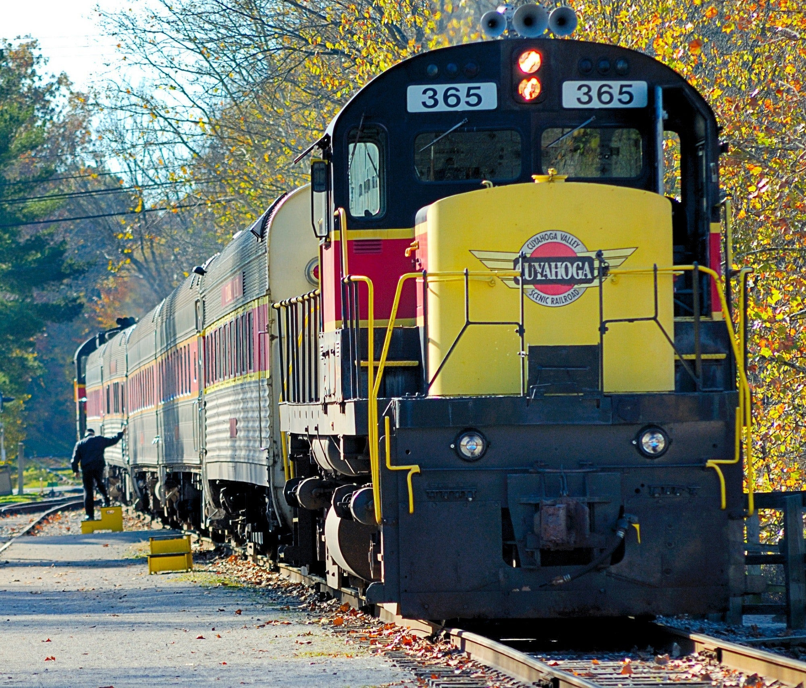

---
execute:
  enabled: false
---

# Python Data Structures {#ch-lab-python-data-structures .unnumbered}

## Recovered activity {#sec-lab-python-data-structures}

::: {.callout-note title="Historical source and execution note"}
This activity was recovered from `python/python_data_structures.ipynb`. Its code is preserved but
is not executed during the public book build, so readers can inspect it without
requiring legacy package versions. Download the [source notebook](../notebooks/python-data-structures.ipynb)
to run and modernize it interactively.
:::


Outline

+ Stacks
+ Queques
+ Deques

## Basic data structures

Linear structures
+ Stacks, queues, deques, and lists
+ Data collections where
  * Items are ordered depending on how they are added/removed
  * Position relative to the other elements that came before and after
+ Two ends of linear structures
  * Where to add and where to remove? 

In this lecture, I'd like to focus on linear data structures. Stacks, queues and deques behave like a list, but they differ in the order of adding new items and the positions where items can be accessed and removed from the list. The design to allow the access of an item from one end but not the other seems restrictive but makes it easier, and sometimes more efficient, to translate a real world problem into a computer solution. 

## Stacks


Here is a stack of books, when you put one on top of the other. There is a natural order in which the books are placed in a stack. You start with the one in the bottom, and add another on top, and continue that way. When you remove it, the most natural way is to remove one book at a time from the top. 

So regardless of whether you are to add or to remove, you access the stack from the top. 

A stack, or “push-down stack”: 
+ An ordered collection of items where
  * the addition of new items and the removal of existing items 
  * always takes place at the same end. 
+ Last-in first-out (LIFO) 

Because of this mechanism of placing one on top of the last and pushing it down, a stack can be thought of as a push-down stack. It is an ordered collection of items where the addition and removal happens at the same end, that is, the top. 

Think about this. When you try to remove a book from a stack, you first remove the last one you put in. So a stack is last-in first-out. 

### Stack Design

Abstract data type (class): 
+ ```Stack()``` creates a new stack that is empty. It needs no parameters and returns an empty stack.
+ ```push(item)``` adds a new item to the top of the stack. It needs the item and returns nothing.
+ ```pop()``` removes the top item from the stack. It needs no parameters and returns the item. The stack is modified. 
+ ```peek()``` returns the top item from the stack but does not remove it. It needs no parameters. The stack is not modified.
+ ```is_empty()``` tests to see whether the stack is empty. It needs no parameters and returns a boolean value.
+ ```size()``` returns the number of items on the stack. It needs no parameters and returns an integer.

Imagine if you are to design Stack data structure, perhaps here are some of the operations or methods you need to have: to push and add a new item, to pop or remove the last item, and to check the size of the stack, that is, the number of items in it. 

### Stack Implementation

An example Stack class, based on a Python list: 

```{python}
#| slideshow: {slide_type: subslide}
class Stack: 
    def __init__(self):
        self.items = []
    
    def is_empty(self):
        return self.items == []
    
    def push(self, item):
        self.items.append(item)
        
    def pop(self):
        return self.items.pop()
    
    def peek(self):
        return self.items[len(self.items)-1]
    
    def size(self):
        return len(self.items)
```

Now if you run this code, it will work fine but you get nothing from it. For now, this only defines the class or the blueprint of what a Stack is. Until you construct an actual Stack (instance) based on the blueprint, it is not real yet. 

Let's look at the Stack blueprint (class) first. The ```__init__``` is the constructor function that will be called when a new Stack instance is created and, at the very moment of creation, whatever code you have here will be used for initialization. Here, ```self``` refers to the new instance just created, within which you have an ```items``` variable holding an empty list with the ```[]```. 

The other functions implement related methods to add, remove, and access the last (top) item in the stack, as well as those to evaluate the size of the stack. 

### Stacks in Action

Now that we have the class (blueprint), let's create Stack instances (objects) and put them into action. 

```{python}
#| slideshow: {slide_type: subslide}
cards = Stack()
print("Is the stack empty for now?", cards.is_empty())
cards.push("J")
cards.push("Q")
cards.push("K")
print("The last card is", cards.peek())
print("There are", cards.size(), "cards in the stack.")
cards.pop()
print("We removed the top.")
print("Now the last card become", cards.peek())
print("There remain", cards.size(), "cards in the stack.")
```

In the code, we first create an empty Stack ```cards``` by calling the ```Stack()``` constructor, which executes whatever you have in the ```__init__``` function. Next, we push or add new cards to the ```cards``` stack, and when we peek, we can only access the last one, "King" which is on the top. And now if we call ```pop()```, we remove the "King". 

### Stack Applications

Why do we need Stacks? 
+ Isn't a ```list``` more flexible? 
+ Why FILO? Isn't that restrictive and making programming more difficult? 

There are very natural questions from students. But there are applications where the restrictive design is a blessing. When the problem you try to solve also exhibits the same restrictive characteristics, the design will make sure related assumptions and conditions are not violated. In fact, the proper mapping of the problem space and the design makes coding easier. 

### Example Application

Math formula checker

Correct: 
```
7 - (5 + (2+3)*10)
```

Incorrect: 
```
7 - (5 + (2+3)*10))))
```

Let's take a look at real world problems. 
Imagine you write a math equation, whenever you open with ```(```, you will have close it to properly with ```)``` at some point. The whole equation should be balanced, e.g. two opening ```(``` matched with two closing ```)``` just like the first equation above. The second equation is incorrect because there are more closing ```)``` than the number of opened ones. 

Related problems in HTML markup: 
```html
<html>
    <head>
        <title>Page Title</title>
    </head>
    <body>
        Page Content
    </body>
</html>
```

Checking math equations is similar to checking code in programs and markup languages. 
In HTML -- XML and XHTML in particular -- tags appear in pairs. A regular HTML tag consists of an opening ```<tag>``` and a closing one ```</tag>```. They should be likewise balanced. So how can we check them, using the idea of a stack?  

So let's try to create a piece of code to check the balance of a match equation. 

```{python}
#| slideshow: {slide_type: subslide}
# Math checker
m = "7 - (5 + (2+3)*10)"
s = Stack()
balanced = True
for symbol in m: 
    if symbol == "(":
        s.push(symbol)
    elif symbol == ")":
        if s.is_empty():
            balanced = False
        else:
            s.pop()

if not s.is_empty():
    balanced = False

print("Is it balanced? ", balanced)
```

For now, we hard code the math equation to show the basic idea. You can certainly make this a function or even a method of a class so you can reuse it. 

We create an empty Stack ```s``` first and assume the result to be correct with ```balanced = True```, unless we find something wrong. 

Now we take each ```symbol``` in the equation ```m``` from left to right, which is what the loop does. For each symbol: 

1. if it opens with a ```(```, we push it to the stack. 
2. if it closes with a ```)```: 
  + if stack is empty, the equation is problematic as no opening ```(``` has preceeded it; 
  + if stack not empty, we remove (pop) the last opening ```(``` on top as it has been **balanced out** (good). 

So going through the math here <font style="color:DarkGreen;">7 - (5 + (2+3)*10)</font>, from left to right: 

|Step| 7 | - | ( | 5 | + | ( | 2 | + | 3 | ) | * | 1 | 0 | ) |   | Stack    | Balanced   |
|----|---|---|---|---|---|---|---|---|---|---|---|---|---|---|---|----------|------------| 
| 1. | 7 |   |   |   |   |   |   |   |   |   |   |   |   |   |   | ```  ``` | ```True``` |
| 2. |   | - |   |   |   |   |   |   |   |   |   |   |   |   |   | ```  ``` | ```True``` |
| 3. |   |   | ( |   |   |   |   |   |   |   |   |   |   |   | + | ```( ``` | ```True``` |
| 4. |   |   |   | 5 |   |   |   |   |   |   |   |   |   |   |   | ```  ``` | ```True``` |
| 5. |   |   |   |   | + |   |   |   |   |   |   |   |   |   |   | ```  ``` | ```True``` |
| 6. |   |   |   |   |   | ( |   |   |   |   |   |   |   |   | + | ```((``` | ```True``` |
| 7. |   |   |   |   |   |   | 2 |   |   |   |   |   |   |   |   | ```((``` | ```True``` |
| 8. |   |   |   |   |   |   |   | + |   |   |   |   |   |   |   | ```((``` | ```True``` |
| 9. |   |   |   |   |   |   |   |   | 3 |   |   |   |   |   |   | ```((``` | ```True``` |
|10. |   |   |   |   |   |   |   |   |   | ) |   |   |   |   | - | ```( ``` | ```True``` |
|11. |   |   |   |   |   |   |   |   |   |   | * |   |   |   |   | ```( ``` | ```True``` |
|13. |   |   |   |   |   |   |   |   |   |   |   | 1 |   |   |   | ```( ``` | ```True``` |
|14. |   |   |   |   |   |   |   |   |   |   |   |   | 0 |   |   | ```( ``` | ```True``` |
|15. |   |   |   |   |   |   |   |   |   |   |   |   |   | ) | - | ```  ``` | ```True``` |

In the end, ```balanced``` remains true and the stack is empty (balanced out). So everyting is good. 

Now for the second equation we had earlier, **7 - (5 + (2+3)*10)<font style="color:red;">))</font>**: 

|Step| 7 | - | ( | 5 | + | ( | 2 | + | 3 | ) | * | 1 | 0 | ) | ) | ) |   | Stack    | Balanced   |
|----|---|---|---|---|---|---|---|---|---|---|---|---|---|---|---|---|---|----------|------------| 
| ..  |
|15. |   |   |   |   |   |   |   |   |   |   |   |   |   | ) |   |   |   | ```  ``` | ```True``` |
|16. |   |   |   |   |   |   |   |   |   |   |   |   |   |   | ) |   |   | ```  ``` | **False**|
|17. |   |   |   |   |   |   |   |   |   |   |   |   |   |   |   | ) |   | ```  ``` | ```False```|

The process will continue with a few more steps with the extra ```)))```. Now that the stack is already empty at step 15, it triggers an ```if``` condition and ```balanced``` will be set to ```False```. 

```python
for symbol in m: 
    ...
    elif symbol == ")":
        if s.is_empty():
            balanced = False
```

Now, what about **7 - <font style="color:red;">((</font>(5 + (2+3)*10)**? 

|Step| 7 | - | ( | 5 | + | ( | ( | ( | 2 | + | 3 | ) | * | 1 | 0 | ) |   | Stack    | Balanced   |
|----|---|---|---|---|---|---|---|---|---|---|---|---|---|---|---|---|---|----------|------------| 
| .. |
| 6. |   |   |   |   |   | ( |   |   |   |   |   |   |   |   |   |   | + | ```((``` | ```True``` |
| 7. |   |   |   |   |   |   | ( |   |   |   |   |   |   |   |   |   | + | ```(((```| ```True``` |
| 8. |   |   |   |   |   |   |   | ( |   |   |   |   |   |   |   |   | + |```((((```| ```True``` |
| .. |
|16. |   |   |   |   |   |   |   |   |   |   |   |   |   |   | ) |   | - | ```((``` | ```True``` |
|17. |   |   |   |   |   |   |   |   |   |   |   |   |   |   |   | ) | - | ```((``` | ```True``` |

Two ```((``` remain the stack after the loop. 
```python
if not s.is_empty:
    balanced = False
```

With extra opening ```(``` early in the equation, the stack will not be balanced out (empty) after the loop. So in the end, the result will be ```False```. See code at the end:  

```python
if not s.is_empty:
    balanced = False
```

Now you may go back to the math checker code, change the formula, and re-run the program. Does it work as you expected? Is the concept of Stack sound like a good idea for the problem here? Thhink about HTML code, do you think it is similar to develop a program to check whether HTML tags are opened and closed properly? 

## Queue


I suppose you don't like waiting, especially if you are late and there is already a long line. 
It might be tempting to push in, but hey, you are not supposed to do that. 

A queue: 
+ An ordered collection of items where
  * the addition of new items happens at one end (rear) 
  * the removal of existing items occurs at the other (front)
+ Queues are **first-in first-out** (FIFO), or first come first served 


A waiting line is a queue, and the rule is first come first served. 

A queue is defined as an ordered collection of items where the addition of new items and the removal of existing items occur at the different ends. This is quite the opposite of a Stack, where you access from the same end. 

So queues are first-in first-out, os first come first served. 

### Queue Design

Queue abstract data type: 

+ ```Queue()``` creates a new queue that is empty. It needs no parameters and returns an empty queue. 
+ ```enqueue(item)``` adds a new item to the rear of the queue. It needs the item and returns nothing. 
+ ```dequeue()``` removes the front item from the queue. It needs no parameters and returns the item. The queue is modified. 
+ ```is_empty()``` tests to see whether the queue is empty. It needs no parameters and returns a boolean value.
+ ```size()``` returns the number of items in the queue. It needs no parameters and returns an integer. 

Again, imgine you are designing a data structure to solve a problem related to queues. Here are potential operations you need to include to support the construction of related algorithms, for example: enqueue to add a new item to the end, dequeue to remove one from the front, and methods to check the size of the queue. 

### Queue Implementation

```{python}
#| slideshow: {slide_type: subslide}
class Queue:
    def __init__(self):
        self.items = []
        
    def is_empty(self):
        return self.items == []
    
    def enqueue(self, item):
        self.items.insert(0, item)
    
    def dequeue(self):
        return self.items.pop()
    
    def size(self):
        return len(self.items)
```

The Queue class is similar to the Stack class we implemented earlier, both using a ```list``` to store items. 
The ```dequeue()``` method is similar to the ```pop()``` in the Stack class, which removes an item at the end of a list. 

Here, conceptually, the end of the items list is in fact the **front** of the queue. Conversely, the ```enqueue()``` method adds an item to position 0, which is, in this case, the **rear** of the queue. 

```{python}
#| slideshow: {slide_type: subslide}
orders = Queue()      # An empty queue first
orders.enqueue("Coke")
orders.enqueue("Burger")
orders.enqueue("Fries")

item = orders.dequeue()    # Coke is served and dequeued
print("Served", item)
item = orders.dequeue()    # Next, Burger is served
print("Served", item)
print("How many orders remain?", orders.size())
item = orders.dequeue()
print("Served", item)
print("Now, has everyone been served?", orders.is_empty())
```

Queue has a wide range of applications, from business transactions, to printer jobs, to any processes where things get done on a first-come first-served basis. The example here shows a sequence of actions to place (add) orders and to get them processed and served (removed). 

## Deques

A deque, or double-ended queue
+ An ordered collection of items similar to the queue
  * Two ends, front and rear
  * Items can be added and removed from either front and rear
+ A deque has all capabilities of a stack and a queue
+ No longer restricted to LIFO and FIFO, with access from both ends
+ Consistent use of addition and removal in the context of application




Deque is an extension of the queue structure. 

Deque, or a double-ended queue, is an ordered collection of items with two ends, the front and the rear, and items can be added and removed from both ends. In this design, a deque has all capabilities of a stack as well as those of a queue. It is no longer last-in first-out or first-in first-out. 

If deque sounds a like weird idea, think about a train. You can add or remove cars to the end of a train; likewise, you attach them to the front. An engine can be attached to either side depending on which direction you want to go. 

### Deque Design

Deque abstract data type: 
+ ```Deque()``` creates a new deque that is empty. It needs no parameters and returns an empty deque. 
+ ```add_front(item)``` adds a new item to the front of the deque. It needs the item and returns nothing.
+ ```add_rear(item)``` adds a new item to the rear of the deque. It needs the item and returns nothing.
+ ```remove_front()``` removes the front item from the deque. It needs no parameters and returns the item. The deque is modified.
+ ```remove_rear()``` removes the rear item from the deque. It needs no parameters and returns the item. The deque is modified.
+ ```is_empty()``` tests to see whether the deque is empty. It needs no parameters and returns a boolean value.
+ ```size()``` returns the number of items in the deque. It needs no parameters and returns an integer.

When designing a deque type, you need to have methods to add and remove from both ends: add_front(), add_rear(), remove_front(), and remove_rear(). 

### Deque class implementation

```{python}
#| slideshow: {slide_type: subslide}
class Deque: 
    def __init__(self):
        self.items = []
    
    def is_empty(self):
        return self.items == []
    
    def add_front(self, item): 
        self.items.append(item)
    
    def add_rear(self, item):
        self.items.insert(0, item)
        
    def remove_front(self):
        return self.items.pop()
    
    def remove_rear(self):
        return self.items.pop(0)
    
    def size(self):
        return len(self.items)
```

Compare this Deque class code to the Queue and Stack we had earlier. It is a combination of methods from the two classes, in different names though. 

### Deque in Action

```{python}
#| slideshow: {slide_type: subslide}
train_cars = Deque()

# attach the cars in the end
train_cars.add_rear("Passengers")
train_cars.add_rear("Dining")
train_cars.remove_rear()
train_cars.add_rear("Parlor")
train_cars.add_rear("Dining")

# attach caboose
train_cars.add_rear("Caboose")

# put engine in front
train_cars.add_front("Engine")

print("How long is the train?", train_cars.size(), "cars")
```

Imagine you are to arrange train engine with different cars. You may play with the code to see the different orders in which the same sequence of cars can be constructed. 

## References

+ Chapter 1 Introduction, of Miller and Ranum (2013). Problem Solving with Algorithms and Data Structures using Python. http://interactivepython.org/runestone/static/pythonds/index.html
+ Chapter 4 Data Structures, of Miller and Ranum (2013). Problem Solving with Algorithms and Data Structures using Python. http://interactivepython.org/runestone/static/pythonds/index.html

