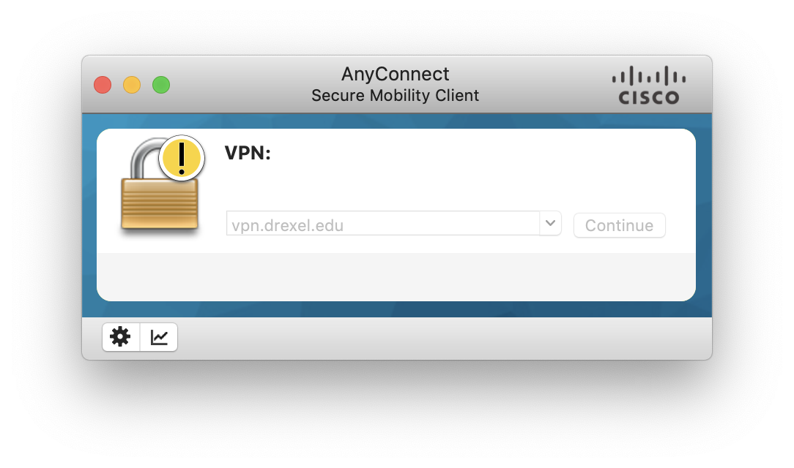
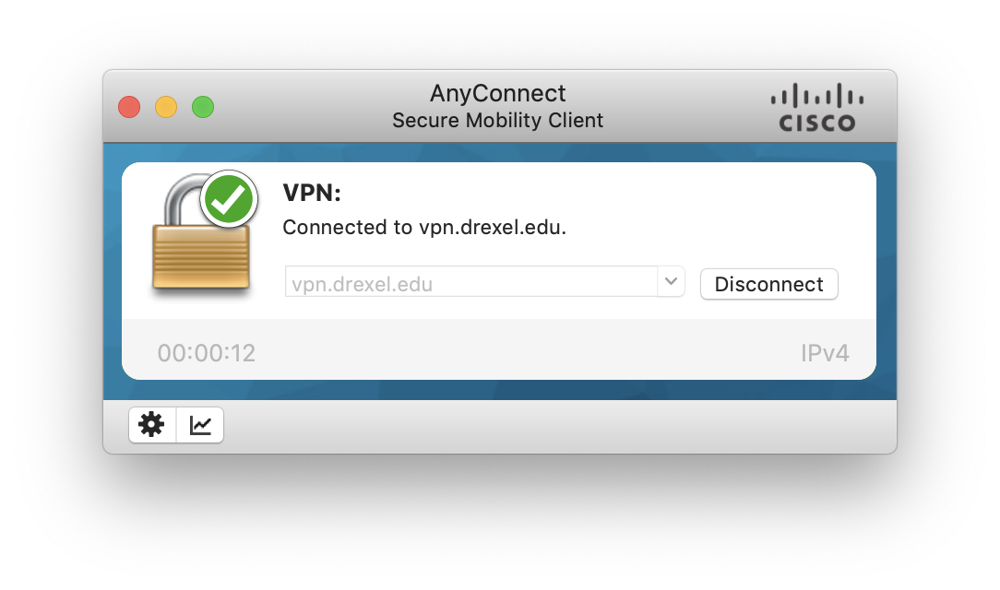
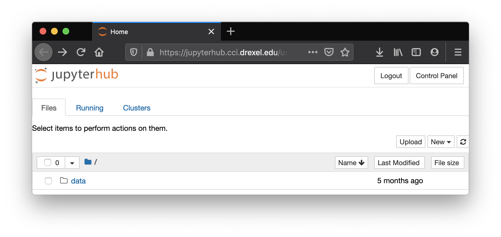
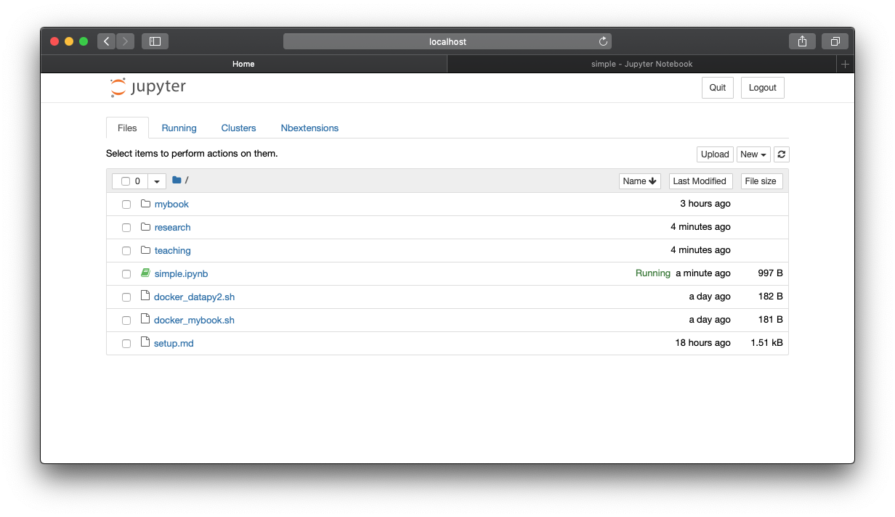
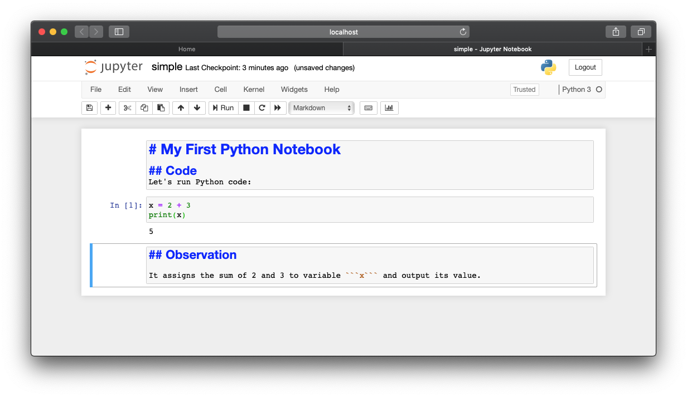

---
execute:
  enabled: false
---

# Python and Jupyter Setup {#ch-lab-setup .unnumbered}

## Recovered activity {#sec-lab-setup}

::: {.callout-note title="Historical source and execution note"}
This activity was recovered from `setup.ipynb`. Its code is preserved but
is not executed during the public book build, so readers can inspect it without
requiring legacy package versions. Download the [source notebook](../notebooks/setup.ipynb)
to run and modernize it interactively.
:::

## Purpose

+ Organize your code and files
+ Organize your data
+ Organize your analysis (output)

Now you are to write Python code to process and analyze data, you need to have good tools to help you manage your code as well your data. Once your write a piece of code, it is a good idea to store the program on the computer so we can run it over and over again without retyping everything. 

Traditionally, here are some options to organize your Python programs:

1. A text editor to create and modify your programs, e.g.: 
    - Notepad on Windows
    - TextEdit on Mac
    - vi on Linux
2. An Integrated Development Environment (IDE), e.g.: 
    - PyCharm, specifically for Python
    - Atom, general purpose for many languages

Today, there is a growing need to organize and manage data and program output as well. 
A data science notebook, e.g. ```Jupyter Notebook```, is a popular choice. 

## Your Options

We will be using ```Python3```, the language in its 3rd generation. 

It works on different platforms including *Windows*, *MacOS*, and *Linux*. 

### Use CCI's JupyterHub (recommended)

The IT team at CCI has setup a JupyterHub server where:
+ Current students can login with their **preconfigured** accounts
+ Use Jupyter Notebook and Python right away, **in the browser**. 

In this case, you don't need to do any setup regarding Python on your computer. 

You do, however, need to have ```Drexel VPN``` so you can be connected to "campus" (virtually) before accessing the JupyterHub. 

Here are steps and related instructions: 
1. Get connected to Drexel **VPN**: https://docs.cci.drexel.edu/display/CD/VPN
2. Once connected, visit **JupyterHub** at: https://jupyterhub.cci.drexel.edu/
3. Enter your username and **TUX password**. 






Note the TUX password is the one you used for ```tux.cs.drexel.edu```, which you received in an encrypted message when you started at CCI. Send an email to ihelp@drexel.edu if you don't know what it is. 

### Setup on Your Computer (optional)

#### Python and Jupyter Notebook

You can install the following on your computer: 
* Python: https://www.python.org/
* Jupytor Notebook: https://jupyter.org/

You may proceed with your own setup of Python environment only if are confident to do so. 
This option does offer you the flexibility of having everything on your computer and does not require VPN. 
But depending on the platform of your computer and version, this may require additional effort. 

You may install Python and Jupyter separately based on instructions from the above sites. 

#### Conda

You may consider Conda to help you install and manage your Python platform: 

https://www.anaconda.com/distribution/

For example, once Conda is installed, you can run: 

```shell
conda install -c conda-forge notebook
```

to install the Jupyter Notebook. 

#### Run Jupyter Notebook

From command line, you can launch your jupyter notebook: 

```shell
jupyter notebook
```

This will start a server and open a local website at http://localhost:8888/ by default.  

## Result

In the end, whether you are using: 

+ A JupyterHub at: https://jupyterhub.cci.drexel.edu/
+ Or a local Jupyter Notebook installation at: http://localhost:8888/

The interface should be similar. Here are a couple of screenshots: 





