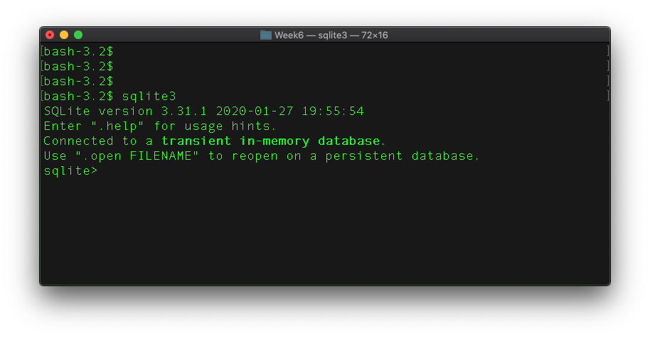
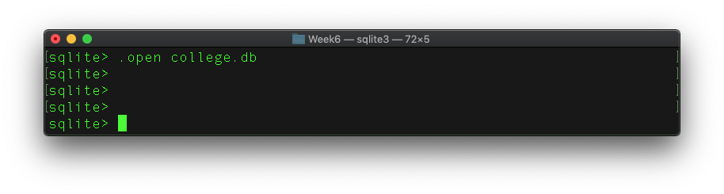

---
execute:
  enabled: false
---

# SQLite Practice {#ch-lab-sqlite .unnumbered}

## Recovered activity {#sec-lab-sqlite}

::: {.callout-note title="Historical source and execution note"}
This activity was recovered from `sql/sqlite.ipynb`. Its code is preserved but
is not executed during the public book build, so readers can inspect it without
requiring legacy package versions. Download the [source notebook](../notebooks/sqlite.ipynb)
to run and modernize it interactively.
:::

## SQLite

SQL: structured query language for relational databases

* SQLite implements a simple SQL dialect
* SQLite uses data files
  * No need to setup a database server
* Widely used and supported, e.g. on mobile phones

## SQLite Interactive

* SQLite has a SQL interactive tool
  * Please download from: http://www.sqlite.org/download.html
  * Guide to SQLite interpreter: http://sqlite.org/cli.html

## SQLite Interactive

1. Download and install SQLite
2. Go to your Terminal or Command Line, and enter: 

```shell
sqlite3
```
3. Start using SQLite interactive with 
    + dot commands
    + SQL statements

Here is the interface on the Mac terminal / command line: 



Enter ```.help``` (a dot command) on SQLite prompt will list all supported commands. 
```shell
sqlite> .help
```

### Load SQL Magic

```{python}
#| slideshow: {slide_type: skip}
%load_ext sql
```

## Database ```college.db```

Suppose we are to manage the following data in a college: 
1. Degree programs with ID, program name, and description
2. Students in the programs, with: ID, name, program information, and class year. 

### Load SQLite Database

```{python}
#| slideshow: {slide_type: skip}
%sql sqlite:///college.db
```

Let's open -- create if it does not exist -- a database file called ```college.db```: 

```shell
sqlite> .open college.db
``` 

Screenshot on Mac terminal: 



We can now create the two tables using SQL statements with the SQLite3 interactive. 

Please note that ```%%sql``` symbols, for example: 

```{python}
#| slideshow: {slide_type: fragment}
%%sql
select * from my_table;
```

in this tutorial is for SQL magic in the Jupyter Notebook and should **be excluded** from your actual SQL statement. 

### ```programs``` table

Create the ```programs``` table structure: 

```{python}
#| slideshow: {slide_type: fragment}
%%sql
drop table if exists programs;
create table programs (
    program_id varchar(10) not null primary key, 
    program_name varchar(20), 
    program_desc varchar(500)
);
```

Now add (insert) program data: 

```{python}
#| slideshow: {slide_type: fragment}
%%sql
insert into programs (program_id, program_name, program_desc)
            values   ('IS', "Information Systems", "Information systems with a business angle");
insert into programs values ('DS', "Data Science", "New data science program");
insert into programs values 
        ('CS', "Computer Science", "Traditional computer science"),
        ('CST', "Computing & Security Technology", "CST with a new focus on security");
```

Now let's take a look at data in the table: 

```{python}
#| slideshow: {slide_type: fragment}
%%sql
select * from programs;
```

### ```students``` table

Create the students table: 

```{python}
#| slideshow: {slide_type: fragment}
%%sql
drop table if exists students;
create table students (
    student_id integer primary key, 
    student_name varchar(100), 
    program_id varchar(10),
    class_year int
);
```

For the students tables, we have preppared a csv file with students records, which can be downloaded from: [students.csv](data/students.csv). 

Suppose data file ```students.csv``` is in the **same directory as the college.db**: 

```csv
1	John Smith,        IS,  2020
2	Albert Einstein,   DS	2021
3	George Washington, CS,  2019
4	Donald Trump,      CST, 2020
5	Barack Obama,      IS,  2021
.   ...                ..   ....
```

You can use the following **dot commands** to import the CSV data: 

```shell
sqlite> .mode csv
sqlite> .import students.csv students
```

Now check out the data: 

```{python}
#| slideshow: {slide_type: fragment}
%%sql
select * from students limit 5;
```

```{python}
#| slideshow: {slide_type: slide}
%%sql
select count(*) from students;
```

### Select and Filter

Now that we have the data, we can go ahead to search the data and run statistics. 

For example, if you are interested in students in the DS program: 

```{python}
#| slideshow: {slide_type: fragment}
%%sql
select * from students where program_id='DS';
```

Or, you would like to know who have graduated before 2019: 

```{python}
#| slideshow: {slide_type: fragment}
%%sql
select * from students where class_year<2019;
```

### Group Aggregates

Perhaps, you only want to know statistics in each program: 

```{python}
#| slideshow: {slide_type: fragment}
%%sql
select program_id, 
       count(*) as student_count, 
       min(class_year) as first_class, 
       max(class_year) as last_class
from students 
group by program_id
order by student_count DESC;
```

### Update Student Data

Now that you see from the statistics some data values are unrealistic such as a class year $>2030$. Perhaps we can reset all these values to $2030$ if they are greater than that:

```{python}
#| slideshow: {slide_type: fragment}
%%sql
update students set class_year = 2030 where class_year > 2030;
```

We can run the statistics again to see if data have been updated: 

```{python}
#| slideshow: {slide_type: fragment}
%%sql
select program_id, 
       count(*) as student_count, 
       min(class_year) as first_class, 
       max(class_year) as last_class
from students 
group by program_id
order by student_count DESC;
```

### Join Tables

Suppose you want to retrieve student data with their corresponding program information (e.g. program name): 

```{python}
#| slideshow: {slide_type: fragment}
%%sql
select student_name, program_name, class_year
from students s join programs p on s.program_id = p.program_id
limit 10;
```

We can rerun the previous statistics based on the program names, instead of program IDs: 

```{python}
#| slideshow: {slide_type: fragment}
%%sql
select program_name, 
       count(*) as student_count, 
       min(class_year) as first_class, 
       max(class_year) as last_class
from students s join programs p on s.program_id = p.program_id
group by program_name
order by student_count DESC;
```

# References

+ Chapter 3 Managing Data, section Managing Data using SQL, of LauraCasselland AlanGauld (2014). Python Projects.https://ebookcentral-proquest-com.ezproxy2.library.drexel.edu/lib/drexel-ebooks/detail.action?docID=1875898
+ SQLite operations in Python:http://sebastianraschka.com/Articles/2014_sqlite_in_python_tutorial.html

This is not the most efficient method to join and run the ```group by``` clause. But for now, it is good for the small dataset here. 

